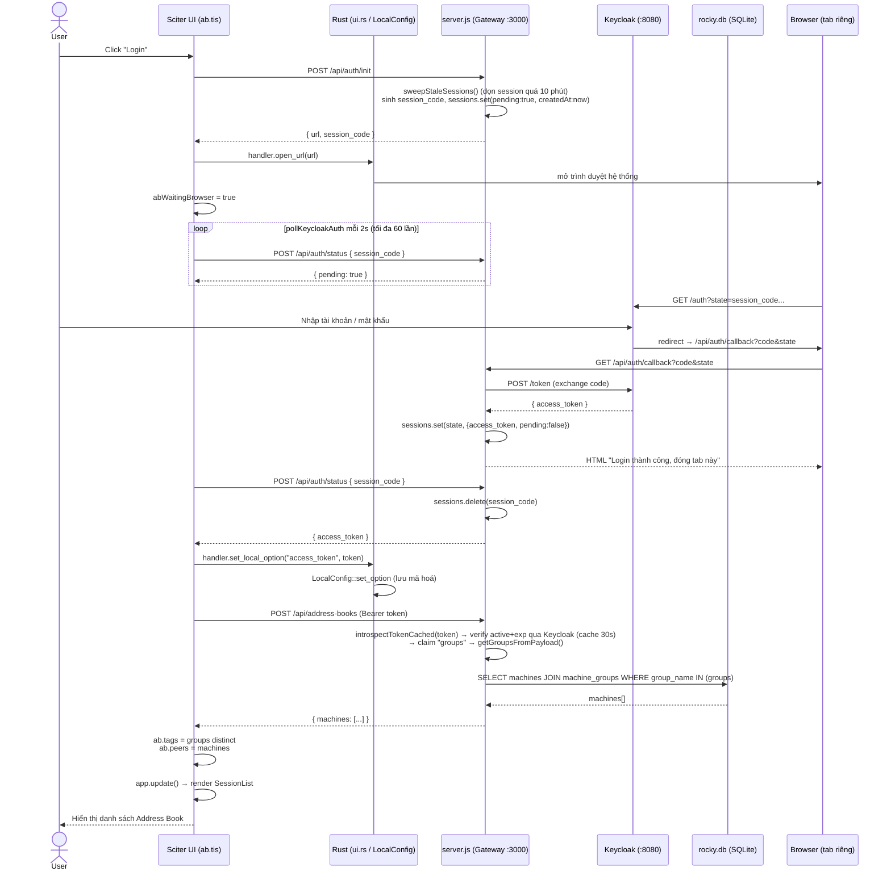
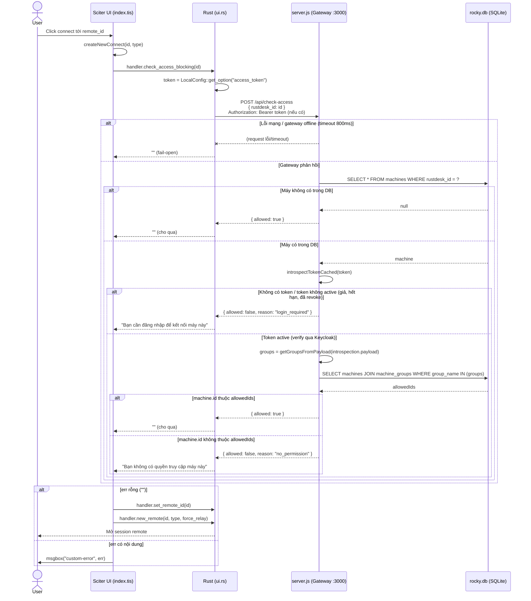
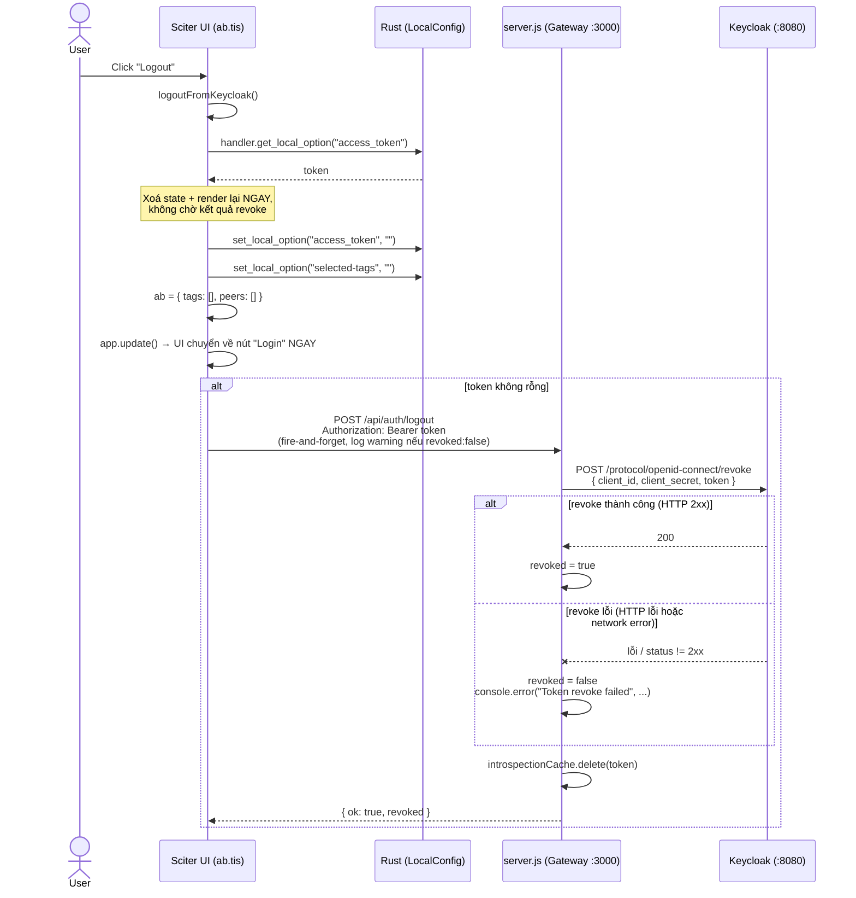

# Address Book & Keycloak Auth Flow (`src/ui/ab.tis` ↔ `src/ui.rs` ↔ `server.js`)

## Overview

Address Book trong ROCKY là một **hybrid** giữa cơ chế gốc của RustDesk và một lớp tích hợp Keycloak/gateway riêng:

- **Data model + API ghi** (`Ab`/`AbEntry`/`AbPeer`, `POST /api/ab`) vẫn dùng cơ chế gốc RustDesk.
- **Nguồn dữ liệu đọc** (danh sách máy + tag hiển thị) đã chuyển sang gateway tự build (`server.js`), lấy theo **Keycloak Group** của user đang đăng nhập (đọc từ claim `groups` trong JWT — trước đây là client-role trên `rustdesk-client`, đã đổi hẳn sang Group, xem Change Log), dữ liệu mapping group↔máy lưu ở `data/rocky.db` (xem `docs/admin-ui.md`).
- **Kiểm soát truy cập trước khi connect** (`check_access_blocking`) là một lớp kiểm tra mềm phía Rust, gọi thẳng gateway, **fail-open** khi lỗi mạng.

Có 2 cầu nối giao tiếp độc lập, không lồng vào nhau:
1. Sciter JS ↔ Rust qua `dispatch_script_call!` / `Element::call_method()` (cơ chế chuẩn của RustDesk).
2. Cả Sciter JS và Rust **đều tự gọi HTTP trực tiếp tới `server.js`** — chia sẻ trạng thái qua `LocalConfig` (`access_token`), không proxy qua nhau.

## Key Files

| File | Vai trò |
|---|---|
| `src/ui/ab.tis` | UI Address Book: render, login/logout Keycloak, lấy danh sách máy, đồng bộ AB gốc |
| `src/ui/index.tis:100-118` | `createNewConnect()` — gọi `check_access_blocking` trước khi connect |
| `src/ui/common.tis:430` | `httpRequest()` — wrapper POST async dùng chung cho mọi gọi gateway từ JS |
| `src/ui.rs:497-528` | `check_access_blocking` — Rust tự gọi `POST /api/check-access` |
| `src/ui.rs:651,659` | `post_request` / `get_async_job_status` — cầu nối JS gọi HTTP qua Rust |
| `src/ui_interface.rs:226,247,887,898` | `get_local_option`/`set_local_option` (map vào `LocalConfig`), `post_request`/`get_async_job_status` (global async job state) |
| `src/common.rs:1399-1497` | `post_request`/`post_request_` — thực thi HTTP POST thật (reqwest), gắn header `Authorization` + `Content-Type: application/json` |
| `libs/hbb_common/src/config.rs:2453-2578` | `Ab`/`AbEntry`/`AbPeer` — struct AB gốc, cache local mã hoá+nén |
| `server.js:636-766` | Endpoint `/api/auth/init|callback|status|logout`, `/api/check-access`, `/api/address-books` |

## Flow

### 1. Login (Keycloak OAuth2 Authorization Code, qua browser tab riêng)

Điểm chú ý:
- `BR` (tab browser) và `TIS` (app Sciter) là 2 tiến trình tách biệt, chỉ nối qua `session_code` lưu tạm trong `sessions` Map (in-memory) của `server.js`. Entry tự dọn sau 10 phút nếu bị bỏ ngang (`sweepStaleSessions()`, đã fix 2026-06-22 — trước đó sống mãi nếu user đóng app/tab giữa lúc redirect Keycloak).
- `Rust` chỉ tham gia ở 2 chỗ: mở browser (`open_url`) và lưu token (`set_local_option`) — không gọi `auth/init`, `auth/status`, `address-books`.
- `introspectTokenCached(token)` verify chữ ký + `exp` thật qua Keycloak `/token/introspect` (đã fix — xem Change Log 2026-06-22), kết quả cache theo token tối đa 30s (`INTROSPECTION_CACHE_TTL_MS`) để tránh round-trip Keycloak trên mỗi request.

### 2. Check-access trước khi connect (đồng bộ, blocking, gọi từ Rust)

Điểm chú ý:
- **Đồng bộ, blocking**: `check_access_blocking` chạy `reqwest::blocking` ngay trong dispatch call — JS chờ Rust chờ HTTP xong mới có kết quả (không async/poll như flow login).
- **Fail-open ở 2 lớp**: lỗi mạng/parse (Rust side) hoặc máy không tồn tại trong DB (gateway side) → đều cho kết nối luôn. Đây là kiểm soát UI/UX, không phải security boundary đáng tin cậy. (Quyết định giữ nguyên, ngoài phạm vi fix 2026-06-22 — xem Change Log.)
- **Đổi hành vi từ 2026-06-22**: token rác/giả/hết hạn (cấu trúc JWT đúng nhưng không verify được qua Keycloak) giờ map về `login_required` thay vì `no_permission` như trước (trước đây `decodeJwtPayload` không bao giờ trả falsy cho token không rỗng, nên token rác bị xử lý nhầm thành "đã login nhưng 0 quyền"). `no_permission` giờ chỉ xảy ra khi token thật sự active nhưng user không thuộc group được cấp quyền cho máy đó.

### 3. Logout

Điểm chú ý:
- Thứ tự thật: **(1) xoá state local → (2) `app.update()` chuyển UI về Login NGAY → (3) mới gửi POST logout lên gateway**. UI không chờ response của bước (3); callback success/error đều là hàm rỗng.
- `if (token)` ở `ab.tis:797` là **defensive check**, không phải nhánh logic hay gặp: nút Logout chỉ render khi đã có `access_token` (`ab.tis:19,57`), và phía server cũng tự `if(token)` tương tự — không có token thì cả 2 phía đều không có gì để revoke.
- **Đã fix (2026-06-22)**: server giờ đọc đúng `status` thật từ response revoke của Keycloak (`httpPost` resolve cả khi Keycloak trả 4xx/5xx, chỉ reject lỗi mạng tầng transport — trước đây code chỉ bắt lỗi mạng, không bao giờ phát hiện được Keycloak từ chối revoke) và trả `{ok:true, revoked}` thay vì luôn `{ok:true}`. `ok` vẫn luôn `true` (gateway tự nó xử lý request thành công), `revoked` mới là tín hiệu thật về kết quả ở Keycloak. Đồng thời xoá token khỏi `introspectionCache` ngay khi logout để token không còn được coi là active trong cửa sổ cache (xem mục Rủi ro #1 đã fix). Client (`ab.tis`) vẫn giữ UX optimistic-logout cũ (xoá state + cập nhật UI trước khi gọi API), chỉ thêm 1 dòng `stderr.println` cảnh báo khi `revoked === false`, không chặn/đổi luồng.

### Rủi ro tổng hợp đã ghi nhận khi rà soát các luồng trên

1. ~~`decodeJwtPayload` không verify JWT signature...~~ **ĐÃ FIX (2026-06-22)** — thay bằng `introspectTokenCached()`, verify chữ ký + `exp` thật qua Keycloak `/token/introspect`, cache 30s theo token. Áp dụng cho cả `/api/check-access` và `/api/address-books`. `decodeJwtPayload()` đã bị xoá khỏi `server.js` (hết người gọi).
2. `check_access_blocking` fail-open khi gateway lỗi/offline — chỉ là UX gate, không phải security boundary. **Chưa fix** — quyết định giữ nguyên, tính năng này được đánh giá là "chưa hoàn thiện", ngoài phạm vi lần rà soát 2026-06-22.
3. ~~Logout không đảm bảo revoke thành công ở Keycloak...~~ **ĐÃ FIX (2026-06-22)** — `/api/auth/logout` giờ đọc status thật từ response revoke, trả `{ok:true, revoked}` thay vì luôn `{ok:true}`, và xoá token khỏi `introspectionCache` ngay khi logout.
4. (Pre-existing, không riêng AB) `ASYNC_JOB_STATUS` trong `src/ui_interface.rs:69,888-894` là **1 biến global duy nhất cho mọi POST request qua `handler.post_request`** (không phân theo URL như GET dùng `ASYNC_HTTP_STATUS: HashMap`). Nếu 2 lệnh `httpRequest()` POST chạy chồng lấp thời gian (ví dụ logout bắn đúng lúc `getAb()`/`updateAb()` cũ đang chờ), 2 vòng poll `check_status()` có thể đọc nhầm kết quả của nhau. Logout không bị ảnh hưởng quan sát được (callback rỗng), nhưng phía bị "ăn nhầm" response có thể parse sai dữ liệu. **Chưa fix** — phạm vi rộng (chạm hạ tầng Rust↔Sciter dùng chung 10 nơi gọi, gồm cả luồng ngoài AB), không chọn trong lần rà soát 2026-06-22.

5. **Mới phát hiện + đã fix (2026-06-22, không có trong 4 rủi ro gốc)**: `sessions` Map (`server.js`, dùng cho polling `/api/auth/init` → `/api/auth/status`) không có TTL — user bỏ ngang luồng login (đóng app/tab giữa lúc redirect Keycloak) để lại entry sống mãi trong memory. Đã thêm `SESSION_TTL_MS` (10 phút) + `sweepStaleSessions()` gọi lazy mỗi lần `/api/auth/init`, kèm carry-forward `createdAt` qua các nhánh `sessions.set()` ở `/api/auth/callback` để không sweep nhầm session vừa hoàn tất nhưng chưa được client poll.

## Change Log

- **2026-06-22 (fix 3 lỗ hổng auth gateway)** — Theo plan
  `.claude/plans/l-p-k-ho-ch-t-m-ticklish-beaver.md`, fix 3/4 rủi ro đã ghi nhận ở mục
  "Rủi ro tổng hợp" + 1 rủi ro mới phát hiện cùng lúc rà soát:
  1. **JWT không verify** (`/api/check-access`, `/api/address-books`): thay
     `decodeJwtPayload()` (chỉ base64-decode, không verify signature/`exp`) bằng
     `introspectTokenCached()` — tái dùng `introspectToken()` (verify thật qua Keycloak
     `/token/introspect`, đã có sẵn cho admin login) + cache 30s theo token
     (`INTROSPECTION_CACHE_TTL_MS`) để không cộng thêm latency Keycloak vào budget
     800ms của `check_access_blocking` (Rust). Token rác/giả/hết hạn/đã-bị-revoke giờ
     nhất quán map về `login_required` (trước đây map nhầm về `no_permission` do
     `decodeJwtPayload` không bao giờ trả falsy cho token không rỗng). `decodeJwtPayload()`
     đã bị xoá khỏi `server.js` (hết người gọi sau khi cả 2 call site đổi xong).
  2. **`sessions` Map leak**: thêm `SESSION_TTL_MS` (10 phút) + `sweepStaleSessions()`,
     gọi lazy mỗi lần `/api/auth/init` (không dùng `setInterval` — khớp pattern lazy-check
     có sẵn của `adminSessions`, không có timer nào tồn tại trong file trước đó). Mỗi
     entry `sessions` giờ có `createdAt`, được carry-forward qua mọi nhánh
     `sessions.set(state, ...)` ở `/api/auth/callback` để không sweep nhầm session vừa
     hoàn tất nhưng client chưa poll kịp.
  3. **Logout silent-fail**: `/api/auth/logout` giờ đọc `status` thật từ response revoke
     của Keycloak (`httpPost` chỉ reject lỗi mạng tầng transport, không reject khi
     Keycloak trả 4xx/5xx — đây là lý do code cũ luôn "thành công"), trả
     `{ok:true, revoked}` thay vì luôn `{ok:true}`, và xoá token khỏi
     `introspectionCache` ngay khi logout (tránh token vừa revoke vẫn "active" trong
     cache tới hết 30s TTL — hệ quả trực tiếp của fix 1, không phải fix độc lập).
     `ab.tis` (`logoutFromKeycloak()`) thêm 1 dòng `stderr.println` cảnh báo khi
     `revoked === false`, không đổi UX optimistic-logout hiện có.
  **Ngoài phạm vi, giữ nguyên** (đã chốt với user, xem rủi ro #2 và #4 ở trên):
  `check_access_blocking` fail-open, `ASYNC_JOB_STATUS` race condition, không thêm
  refresh-token flow (đã xác nhận token hết hạn không làm văng session remote đang
  chạy, chỉ ảnh hưởng lần connect/refresh AB tiếp theo — user chấp nhận phải login lại).

- **2026-06-21 (fix cấu hình Keycloak — claim `groups` rỗng/sai)** — Sau khi áp dụng
  redesign role→Group (entry ngay dưới), test thật trên Keycloak vẫn bị
  `POST /api/address-books` trả `machinesReturned: []` dù mapping group↔máy trong
  `data/rocky.db` đã đúng (`groupsMapInDb` có sẵn `phong-ke-toan`/`phong-nhan-su` với
  đúng machine_id). Đây là lỗi **cấu hình Keycloak**, không phải bug code — debug bằng
  log tạm có sẵn ở `server.js` (`[address-books DEBUG]`, in `payload.groups` thô trước
  khi qua `getGroupsFromPayload`), lần theo 2 bước:
  1. **Lần đầu**: `rawGroupsClaim` ra 3 default realm role
     (`offline_access`, `default-roles-rustdesk`, `uma_authorization`) thay vì tên
     Group. Nguyên nhân: protocol mapper gắn Token Claim Name `groups` trên
     `rustdesk-client` đang là **Mapper Type "User Realm Role"** (mapping role) chứ
     không phải **"Group Membership"** (mapping group) — tên claim đặt đúng `groups`
     nhưng loại mapper sai nên lấy nhầm nguồn dữ liệu.
  2. **Sau khi đổi đúng Mapper Type "Group Membership"**: `rawGroupsClaim` lại ra
     `undefined` — claim biến mất hoàn toàn khỏi access token dù mọi toggle
     "Add to access token"/"Add to ID token"/"Add to userinfo" đều đã On. Root cause
     thật: trong form cấu hình mapper, ô **"Token Claim Name" bị để trống**. Field
     **"Name"** (đã điền `groups`) chỉ là tên hiển thị của mapper trong Keycloak admin
     console — **không** quyết định tên key trong JWT; phải điền riêng
     **"Token Claim Name" = `groups`** thì claim mới thực sự xuất hiện trong token.
     Đây là 1 nhầm lẫn dễ gặp vì 2 field "Name" và "Token Claim Name" đứng cạnh nhau,
     cùng kiểu input text, không có gợi ý rõ field nào quyết định claim key thật.
  **Fix:** điền `Token Claim Name = groups`, tắt **Full group path** (đổi On → Off, để
  khớp chuẩn hoá ở `getGroupsFromPayload` — claim trả `phong-ke-toan` thẳng thay vì
  `/phong-ke-toan`), giữ nguyên `Add to access token = On`. Không đổi code. Đã verify:
  đăng nhập lại → `rawGroupsClaim` ra đúng tên group user thuộc → `machinesReturned`
  có dữ liệu.
  **Checklist cho lần setup Keycloak tiếp theo** (server mới/máy khác): khi tạo mapper
  "Group Membership" trên `rustdesk-client-dedicated`, luôn kiểm tra đủ 2 điều kiện —
  (a) Mapper Type đúng là "Group Membership" (không phải "User/Client Role"), và
  (b) ô "Token Claim Name" có giá trị `groups` (không để trống) — thiếu 1 trong 2 đều
  khiến `/api/address-books` và `/api/check-access` luôn coi user không thuộc group nào.

- **2026-06-21 (redesign phân quyền)** — Chuyển nguồn machine-access từ **Keycloak
  client-role trên `rustdesk-client`** sang **Keycloak Group** (realm-level), theo plan
  `.claude/plans/t-i-c-n-m-t-m-iridescent-goose.md` (chi tiết đầy đủ + sequence diagram
  ở `docs/admin-ui.md`). Thay đổi cụ thể liên quan tới luồng trong file này:
  - `server.js`: `getRolesFromPayload(payload)` → `getGroupsFromPayload(payload)` (đọc
    claim **`groups`** trong JWT thay vì `realm_access`/`resource_access` roles — cần
    thêm protocol mapper "Group Membership" trên `rustdesk-client`, Token Claim Name
    `groups`, Full group path OFF, Add to access token ON; gateway tự strip 1 dấu `/`
    đầu để chuẩn hoá phòng trường hợp Keycloak vẫn trả full path). `getMachinesForRoles`
    → `getMachinesForGroups`, bảng SQLite `machine_roles` → `machine_groups`. Áp dụng
    cho cả `/api/check-access` và `/api/address-books`.
  - `ab.tis` (`getAddressBooks()`, 2 dòng): `m.roles` → `m.groups` khi đọc field từ
    response của `/api/address-books`. **Quyết định phạm vi:** giữ nguyên label UI
    "Tags"/"Add Tag"/"Edit Tag" — đây là khái niệm tag chung có sẵn của RustDesk, không
    phải chữ "Role", nên không cần đổi để khớp ngữ nghĩa "Group".
  - `src/ui.rs` (`check_access_blocking`), `src/ui/index.tis` (`createNewConnect`),
    `src/ui_interface.rs`, `src/common.rs`: **không đổi gì** — đã xác nhận khi rà soát
    là các lớp này chỉ forward bearer token + đọc field `allowed`/`reason` (boolean/
    string chung), không tự đọc field `roles`/`groups` nào, nên hoàn toàn trung lập với
    việc đổi ngữ nghĩa phía gateway từ role sang group.
  - Không giữ song song cơ chế role cũ — chuyển hẳn 100% sang Group theo quyết định đã
    chốt với user (dữ liệu role↔máy cũ chỉ là demo, không cần bảo toàn).
  - 4 rủi ro đã ghi nhận ở mục "Rủi ro tổng hợp" bên dưới (JWT không verify signature,
    fail-open của `check_access_blocking`, revoke logout không đảm bảo, race
    `ASYNC_JOB_STATUS`) **không đổi** — đổi role→group không ảnh hưởng các rủi ro này,
    vẫn nguyên trạng.
- **2026-06-19** — Tạo file này để ghi lại các luồng Address Book/Auth (login Keycloak, hiển thị AB, check-access trước khi connect, logout) đã được giải thích và vẽ sequence diagram trong quá trình rà soát code. Không có thay đổi code — chỉ tổng hợp tài liệu + 4 rủi ro phát hiện được khi đọc kỹ `ab.tis`/`ui.rs`/`server.js`/`ui_interface.rs`.
