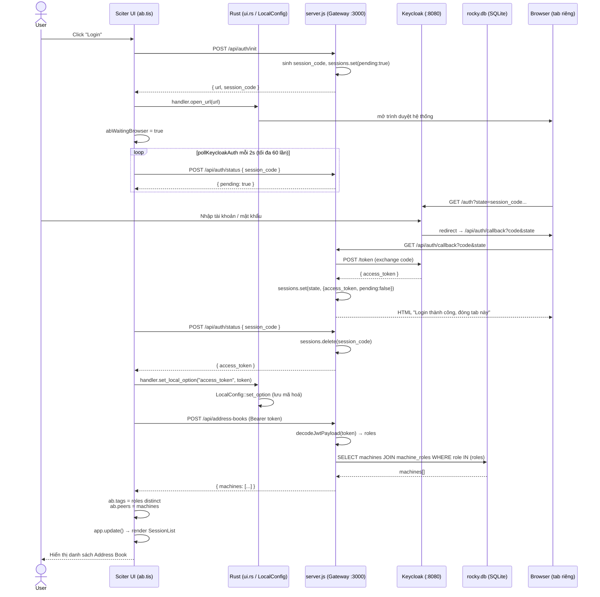
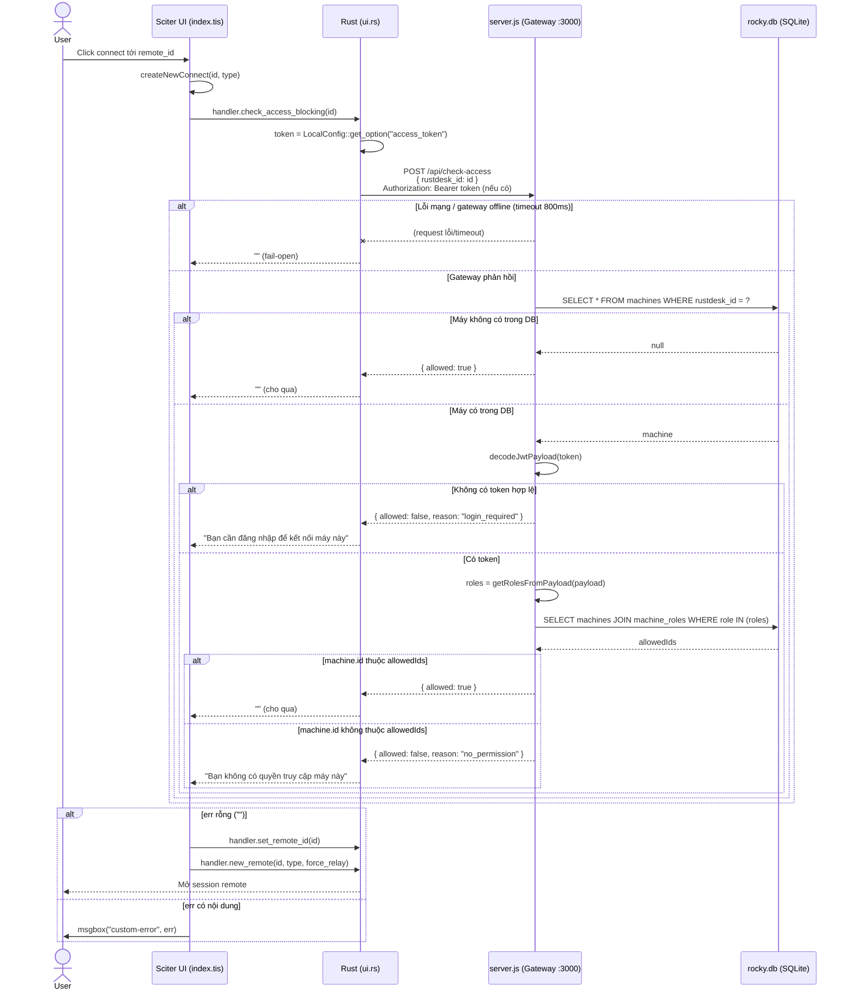
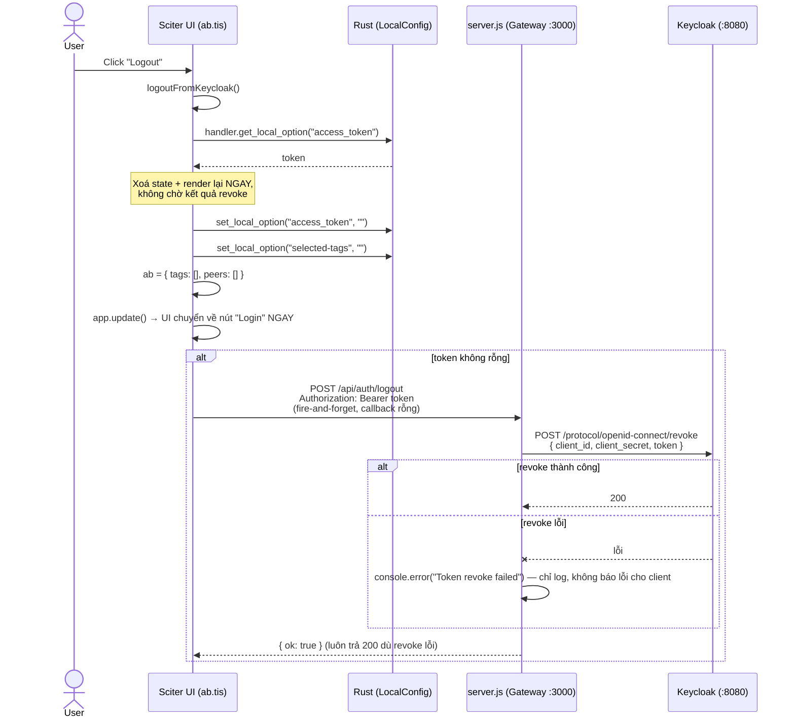

# Address Book & Keycloak Auth Flow (`src/ui/ab.tis` ↔ `src/ui.rs` ↔ `server.js`)

## Overview

Address Book trong ROCKY là một **hybrid** giữa cơ chế gốc của RustDesk và một lớp tích hợp Keycloak/gateway riêng:

- **Data model + API ghi** (`Ab`/`AbEntry`/`AbPeer`, `POST /api/ab`) vẫn dùng cơ chế gốc RustDesk.
- **Nguồn dữ liệu đọc** (danh sách máy + tag hiển thị) đã chuyển sang gateway tự build (`server.js`), lấy theo **role Keycloak** của user đang đăng nhập, dữ liệu mapping role↔máy lưu ở `data/rocky.db` (xem `docs/admin-ui.md`).
- **Kiểm soát truy cập trước khi connect** (`check_access_blocking`) là một lớp kiểm tra mềm phía Rust, gọi thẳng gateway, **fail-open** khi lỗi mạng.

Có 2 cầu nối giao tiếp độc lập, không lồng vào nhau:
1. Sciter JS ↔ Rust qua `dispatch_script_call!` / `Element::call_method()` (cơ chế chuẩn của RustDesk).
2. Cả Sciter JS và Rust **đều tự gọi HTTP trực tiếp tới `server.js`** — chia sẻ trạng thái qua `LocalConfig` (`access_token`), không proxy qua nhau.

## Key Files

| File | Vai trò |
|---|---|
| `src/ui/ab.tis` | UI Address Book: render, login/logout Keycloak, lấy danh sách máy, đồng bộ AB gốc |
| `src/ui/index.tis:100-118` | `createNewConnect()` — gọi `check_access_blocking` trước khi connect |
| `src/ui/common.tis:430` | `httpRequest()` — wrapper POST async dùng chung cho mọi gọi gateway từ JS |
| `src/ui.rs:497-528` | `check_access_blocking` — Rust tự gọi `POST /api/check-access` |
| `src/ui.rs:651,659` | `post_request` / `get_async_job_status` — cầu nối JS gọi HTTP qua Rust |
| `src/ui_interface.rs:226,247,887,898` | `get_local_option`/`set_local_option` (map vào `LocalConfig`), `post_request`/`get_async_job_status` (global async job state) |
| `src/common.rs:1399-1497` | `post_request`/`post_request_` — thực thi HTTP POST thật (reqwest), gắn header `Authorization` + `Content-Type: application/json` |
| `libs/hbb_common/src/config.rs:2453-2578` | `Ab`/`AbEntry`/`AbPeer` — struct AB gốc, cache local mã hoá+nén |
| `server.js:636-766` | Endpoint `/api/auth/init|callback|status|logout`, `/api/check-access`, `/api/address-books` |

## Flow

### 1. Login (Keycloak OAuth2 Authorization Code, qua browser tab riêng)

Điểm chú ý:
- `BR` (tab browser) và `TIS` (app Sciter) là 2 tiến trình tách biệt, chỉ nối qua `session_code` lưu tạm trong `sessions` Map (in-memory) của `server.js`.
- `Rust` chỉ tham gia ở 2 chỗ: mở browser (`open_url`) và lưu token (`set_local_option`) — không gọi `auth/init`, `auth/status`, `address-books`.
- `decodeJwtPayload` chỉ decode base64url phần payload, **không verify chữ ký JWT** (`server.js:253`) — risk nếu gateway lộ ra mạng không tin cậy.

### 2. Check-access trước khi connect (đồng bộ, blocking, gọi từ Rust)

Điểm chú ý:
- **Đồng bộ, blocking**: `check_access_blocking` chạy `reqwest::blocking` ngay trong dispatch call — JS chờ Rust chờ HTTP xong mới có kết quả (không async/poll như flow login).
- **Fail-open ở 2 lớp**: lỗi mạng/parse (Rust side) hoặc máy không tồn tại trong DB (gateway side) → đều cho kết nối luôn. Đây là kiểm soát UI/UX, không phải security boundary đáng tin cậy.

### 3. Logout

Điểm chú ý:
- Thứ tự thật: **(1) xoá state local → (2) `app.update()` chuyển UI về Login NGAY → (3) mới gửi POST logout lên gateway**. UI không chờ response của bước (3); callback success/error đều là hàm rỗng.
- `if (token)` ở `ab.tis:797` là **defensive check**, không phải nhánh logic hay gặp: nút Logout chỉ render khi đã có `access_token` (`ab.tis:19,57`), và phía server cũng tự `if(token)` tương tự (`server.js:638-639`) — không có token thì cả 2 phía đều không có gì để revoke.
- Server luôn trả `{ok:true}` dù lệnh `revoke` ở Keycloak thất bại (chỉ `console.error`, không propagate lỗi) → token **có thể vẫn còn hợp lệ ở Keycloak** tới khi tự hết hạn, dù app đã hiển thị như đã logout xong. Đây là rủi ro cần lưu ý nếu cần đảm bảo revoke chắc chắn (nên đọc response status từ Keycloak và báo lỗi lên client nếu revoke fail).

### Rủi ro tổng hợp đã ghi nhận khi rà soát các luồng trên

1. `decodeJwtPayload` không verify JWT signature — chấp nhận mọi token có cấu trúc đúng `header.payload.signature`, dù chữ ký giả (`server.js:253`, áp dụng cho cả `/api/check-access` và `/api/address-books`).
2. `check_access_blocking` fail-open khi gateway lỗi/offline — chỉ là UX gate, không phải security boundary.
3. Logout không đảm bảo revoke thành công ở Keycloak (silent failure, xem mục 3 trên).
4. (Pre-existing, không riêng AB) `ASYNC_JOB_STATUS` trong `src/ui_interface.rs:69,888-894` là **1 biến global duy nhất cho mọi POST request qua `handler.post_request`** (không phân theo URL như GET dùng `ASYNC_HTTP_STATUS: HashMap`). Nếu 2 lệnh `httpRequest()` POST chạy chồng lấp thời gian (ví dụ logout bắn đúng lúc `getAb()`/`updateAb()` cũ đang chờ), 2 vòng poll `check_status()` có thể đọc nhầm kết quả của nhau. Logout không bị ảnh hưởng quan sát được (callback rỗng), nhưng phía bị "ăn nhầm" response có thể parse sai dữ liệu.

## Change Log

- **2026-06-19** — Tạo file này để ghi lại các luồng Address Book/Auth (login Keycloak, hiển thị AB, check-access trước khi connect, logout) đã được giải thích và vẽ sequence diagram trong quá trình rà soát code. Không có thay đổi code — chỉ tổng hợp tài liệu + 4 rủi ro phát hiện được khi đọc kỹ `ab.tis`/`ui.rs`/`server.js`/`ui_interface.rs`.
