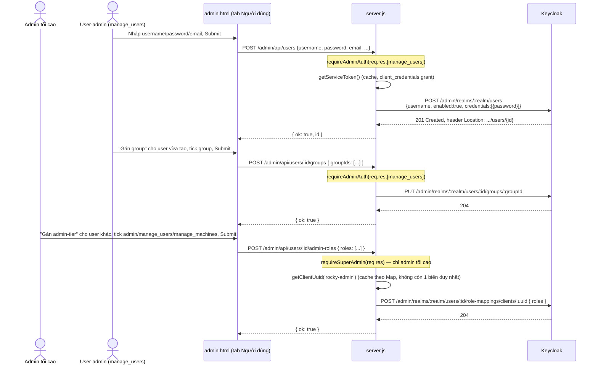
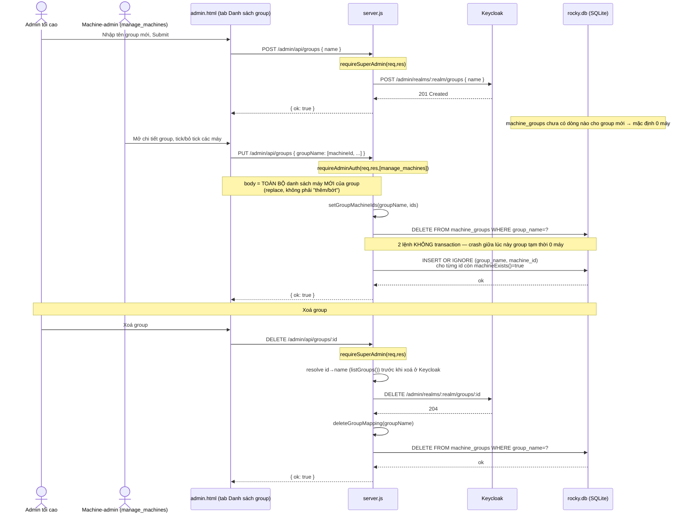

# Admin UI & Gateway (server.js + public/admin.html)

## Overview

Gateway Node.js (`server.js`) và giao diện quản trị web (`public/admin.html`) cho phép quản trị viên IT quản lý **máy trạm (machines)**, **Keycloak Group** (machine-access) và **người dùng Keycloak**, đồng thời phục vụ luồng đăng nhập SSO và kiểm soát truy cập cho client ROCKY (`src/ui/ab.tis`). Dữ liệu máy trạm và ánh xạ Group↔máy được lưu trong SQLite (`data/rocky.db`) thông qua module built-in `node:sqlite` — không có npm dependency.

**Phân quyền Admin UI là 3 tier riêng biệt** trên Keycloak client `rocky-admin`:
- `admin` (admin tối cao) — full quyền + duy nhất tạo/xoá Group + duy nhất gán role admin-tier cho user khác.
- `manage_users` (quản trị người dùng) — CRUD user + gán user vào Group, không gán được role admin-tier.
- `manage_machines` (quản trị máy trạm) — CRUD máy + gán máy↔Group, không tạo/xoá Group.

Đây là model **hoàn toàn tách biệt** với khái niệm Group dùng cho machine-access của Rocky desktop client (mục dưới) — admin-tier role nằm trên client `rocky-admin`, còn Group machine-access là Keycloak Group (realm-level), gán cho user thông qua `rustdesk-client`.

## Key Files

| File | Vai trò |
|---|---|
| `server.js` | HTTP server: Admin REST API, OIDC auth proxy với Keycloak, endpoint kiểm soát truy cập, lớp truy cập SQLite |
| `public/admin.html` | SPA quản trị: 3 tab Người dùng / Danh sách role / Danh sách máy |
| `data/rocky.db` | SQLite database (tự sinh khi chạy `node server.js` lần đầu) |
| `data.json` | File JSON lịch sử — chỉ đọc một lần để migrate sang `data/rocky.db` nếu DB còn rỗng, sau đó không còn được dùng |
| `src/ui/ab.tis` | Client Sciter — gọi `/api/address-books`, `/api/check-access`, hiển thị danh sách máy theo role |

## Flow

### Schema SQLite

```sql
CREATE TABLE machines (
  id          TEXT PRIMARY KEY,
  alias       TEXT NOT NULL DEFAULT '',
  rustdesk_id TEXT NOT NULL DEFAULT '',
  note        TEXT NOT NULL DEFAULT ''
);
CREATE TABLE machine_groups (
  group_name TEXT NOT NULL,
  machine_id TEXT NOT NULL,
  PRIMARY KEY (group_name, machine_id)
);
```

Không có cột `tag` (đã bỏ khỏi mô hình máy trạm — xem Change Log). Quan hệ N–N giữa **Keycloak Group** (không phải role nữa) và máy lưu trực tiếp trong `machine_groups` — thay hẳn cho `machine_roles` cũ, đã xoá hoàn toàn cơ chế role-trên-`rustdesk-client` cho mục đích machine-access, không giữ song song.

### Lớp truy cập dữ liệu trong `server.js`

| Hàm | Việc làm |
|---|---|
| `getAllMachines()` | Lấy toàn bộ máy, gắn thêm `groups: [...]` cho mỗi máy |
| `getMachineById(id)` / `getMachineByRustdeskId(rid)` | Tra cứu 1 máy |
| `insertMachine()` / `updateMachine()` / `deleteMachine()` | CRUD máy (xóa máy tự xóa luôn các dòng `machine_groups` liên quan) |
| `setMachineGroups(machineId, groupNames)` | Ghi lại toàn bộ group của 1 máy |
| `getGroupsMap()` | `{groupName: [machineId,...]}` — dùng cho `GET /admin/api/groups` |
| `setGroupMachineIds(groupName, ids)` | Ghi lại toàn bộ máy thuộc 1 group — dùng cho `PUT /admin/api/groups` |
| `deleteGroupMapping(groupName)` | Xóa toàn bộ mapping của 1 group (khi xóa Keycloak Group) |
| `getMachinesForGroups(groupNames)` | Trả về máy (kèm `groups`) mà ít nhất 1 group trong danh sách có quyền — dùng cho `/api/check-access` và `/api/address-books` |
| `listGroups()` / `createGroup()` / `deleteGroupById()` / `getGroupMembers()` / `addUserToGroup()` / `removeUserFromGroup()` | Gọi Keycloak Admin REST API `/admin/realms/{realm}/groups...` — Group là **realm-level**, không cần lookup `clientUuid` như client-role trước đây |

### Migration một lần từ `data.json`

Khi khởi động, `migrateFromJsonIfNeeded()` kiểm tra `SELECT COUNT(*) FROM machines`:
- Nếu > 0 → bỏ qua (đã có dữ liệu, không migrate lại).
- Nếu = 0 và `data.json` tồn tại → chỉ di trú `machines` (bỏ field `tag`); **không** di trú `roles` cũ — role Keycloak cũ (`admin`/`viewer`/`guest`/`test`) không có Group tương ứng nào trong model mới.
- Nếu = 0 và không có `data.json` → seed 3 máy demo + 1 group demo (`demo-group`).

### Luồng kiểm soát truy cập / Address Book (đổi từ role sang Group)

```
ROCKY client (ab.tis / ui.rs)
    │ POST /api/check-access {rustdesk_id} + Bearer token
    │ POST /api/address-books            + Bearer token
    ▼
server.js: decode JWT → claim "groups" → getMachinesForGroups(groups)
    ▼
SQLite (machines ⨝ machine_groups)
```

`/api/address-books` trả về mỗi machine kèm field `groups: [...]` (Keycloak Group user đang thuộc) — `ab.tis` dùng field này để dựng panel filter bên trái Address Book (UI vẫn gọi là "Tags" — quyết định giữ nguyên label, chỉ đổi nguồn dữ liệu, xem `docs/address-book.md`).

### Đăng nhập Admin UI — tier-aware (3 role admin-tier trên `rocky-admin`)

```mermaid
sequenceDiagram
    actor Admin
    participant UI as admin.html
    participant GW as server.js
    participant KC as Keycloak

    Admin->>UI: Click "Đăng nhập với Keycloak"
    UI->>GW: GET /admin/login
    GW-->>Admin: 302 → Keycloak /auth (prompt=login)
    Admin->>KC: Nhập username/password
    KC-->>GW: GET /admin/auth/callback?code&state
    GW->>KC: POST /token, POST /token/introspect
    KC-->>GW: introspection { active, resource_access }
    GW->>GW: roles = getRolesFromPayload(introspection, "rocky-admin")
    alt không có admin/manage_users/manage_machines
        GW-->>Admin: 403 "Tài khoản không có quyền quản trị"
    else có ít nhất 1 trong 3 role admin-tier
        GW->>GW: tạo admin_session { sub, username, roles, expiresAt }
        GW-->>Admin: Set-Cookie admin_session, 302 → /admin
    end
    UI->>GW: GET /admin/session
    GW-->>UI: { authenticated: true, username, roles }
    UI->>UI: myAdminRoles = roles; applyTierVisibility() — ẩn/hiện tab + nút theo tier
```

Điểm chú ý:
- Trước đây `/admin/auth/callback` chỉ chấp nhận đúng role `admin` — user chỉ có `manage_users`/`manage_machines` sẽ bị 403 ngay từ login, chưa kịp vào app shell. Đã sửa thành chấp nhận **bất kỳ 1 trong 3** role admin-tier.
- `requireAdminAuth(req, res, allowedRoles)` gate theo tier ở **từng route** `/admin/api/*` (trước đây 1 check duy nhất, toàn cục, không phân tầng). `admin` luôn bypass mọi tier-check. `requireSuperAdmin(req, res)` riêng cho route chỉ admin tối cao (tạo/xoá Group, gán role admin-tier).
- `/admin/session` đã trả `roles: session.roles` từ trước (không đổi response shape) — chỉ cần `admin.html` tận dụng field này.

### Luồng tạo user + gán Group (machine-access) + gán admin-tier role



Điểm chú ý:
- `getServiceToken()` lấy access token cho **chính server.js** qua `client_credentials` grant (service account của client `rustdesk-client`) — vì phiên đăng nhập admin (`admin_session` cookie) là auth nội bộ của gateway, không sinh ra token Keycloak nào để forward.
- `getClientUuid(clientId)` (đã tổng quát hoá, cache theo `Map` thay vì 1 biến `cachedClientUuid` duy nhất) tra UUID nội bộ Keycloak — dùng cho cả `rustdesk-client` (không còn cần cho machine-access, chỉ còn dùng nếu cần) và `rocky-admin` (gán role admin-tier).
- **Gán Group (machine-access)** và **gán role admin-tier** là 2 route hoàn toàn tách biệt (`/admin/api/users/:id/groups` vs `/admin/api/users/:id/admin-roles`), với 2 tier-gate khác nhau — `manage_users` chỉ gán được Group, **không** gán được role admin-tier cho ai (tránh leo thang quyền, chỉ admin tối cao mới gán role admin-tier).
- Tạo user và gán Group/role là các request riêng, không transaction — nếu bước sau lỗi, user tồn tại trên Keycloak nhưng chưa có Group/role nào, admin phải tự gán lại từ UI.

### Luồng tạo Keycloak Group + map Group↔máy



Điểm chú ý:
- **Group là realm-level** (`/admin/realms/:realm/groups`) — không cần lookup `clientUuid` như client-role trước đây, đơn giản hơn cơ chế role cũ.
- **Tạo/xoá Group là độc quyền admin tối cao** (`requireSuperAdmin`); **map Group↔máy là việc của machine-admin** (`requireAdminAuth(...,[manage_machines])`) — 2 quyền tách biệt theo đúng yêu cầu: group do admin tối cao sở hữu (khung), nhưng machine-admin tự quản lý nội dung mapping máy của khung đó.
- Khác biệt API quan trọng so với role cũ: Keycloak Group/membership API làm việc theo **group ID** (UUID Keycloak sinh ra), không theo tên như role cũ (`DELETE /clients/:uuid/roles/:roleName` nhận tên trực tiếp trong URL). Route xoá Group phải resolve `id→name` (qua `listGroups()`) **trước khi** gọi Keycloak, để biết được mapping SQLite (key theo tên) cần xoá sau khi Keycloak xoá thành công.
- Xoá Group: 2 lệnh tách biệt (Keycloak rồi SQLite), không transaction — nếu crash giữa 2 bước, `machine_groups` có thể còn sót dòng tham chiếu Group đã không còn tồn tại trên Keycloak (cùng rủi ro đã ghi nhận cho role cũ, không phải vấn đề mới).

Điểm chú ý:
- Role **tồn tại** ở Keycloak (`clients/:uuid/roles`), nhưng **role↔máy** chỉ lưu ở SQLite (`machine_roles`) — 2 nguồn dữ liệu tách biệt, được gộp lại khi đọc ở `GET /admin/api/roles`.
- `PUT /admin/api/roles`: body là **toàn bộ danh sách máy mới** của role đó (UI tự tick rồi gửi full list) — server không tính diff, chỉ `DELETE` hết mapping cũ rồi `INSERT` lại theo danh sách mới (`setRoleMachineIds`, `server.js:161-167`). 2 câu SQL này **không nằm trong transaction** — nếu crash giữa lúc đó, role tạm thời còn 0 máy cho tới khi admin submit lại.
- Xoá role: thứ tự là **xoá ở Keycloak trước, xoá mapping SQLite sau** — 2 lệnh tách biệt, không transaction. Nếu tiến trình chết giữa 2 bước, `machine_roles` còn sót dòng tham chiếu tới role đã không còn tồn tại trên Keycloak; vì `GET /admin/api/roles` chỉ liệt kê role theo nguồn Keycloak (`kcRolesList`) nên dòng rác này không hiện ra ở UI, nhưng vẫn tồn đọng trong DB tới khi được dọn bằng tay.

## Change Log

- **2026-06-23** — Tab "Người dùng" (`public/admin.html`):
  1. Thêm cột **Role** vào bảng users (giữa Groups và Trạng thái), hiển thị nhãn các
     role admin-tier (`admin`/`manage_users`/`manage_machines`) của từng user qua hàm
     mới `renderUserRoles()` (mirror `renderUserGroups()`), đọc field `adminRoles` đã có
     sẵn từ `GET /admin/api/users` — không cần sửa `server.js`.
  2. Phần "+ Tạo người dùng mới" bọc lại trong `<form id="create-user-form"
     onsubmit="return false;">` và thêm khung `#create-user-extra` (hàm mới
     `renderCreateUserExtra()`) cho phép gán Group/Role **ngay lúc tạo user**, thay vì
     phải tạo xong rồi bấm "Gán group"/"Gán admin-tier" riêng như trước. Nội dung khung
     phụ thuộc quyền của **người đang đăng nhập**: admin tối cao thấy cả checkbox Role
     admin-tier + Group; chỉ có `manage_users` thì chỉ thấy checkbox Group (đúng
     `requireSuperAdmin()` đang gate `/admin/api/users/:id/admin-roles`,
     `server.js:651`). `createUser()` sau khi tạo user xong gọi nối tiếp 2 endpoint gán
     Group/Role có sẵn (`POST /admin/api/users/:id/groups`,
     `POST /admin/api/users/:id/admin-roles`) — không có endpoint mới, không sửa
     `server.js`.
  3. Tách 3 dòng label role (`admin`/`manage_users`/`manage_machines`) đang lặp lại
     thành hằng số chung `ADMIN_TIERS`, dùng ở cả `renderUserRoles()`,
     `renderCreateUserExtra()` và `openAdminTierEditor()` (trước đó khai báo cục bộ
     `tiers` riêng trong từng hàm).
  Plan: `.claude/plans/ch-c-n-ng-qu-n-tranquil-blossom.md`.
- **2026-06-23 (follow-up)** — 2 chỉnh sửa luồng nhỏ trên cùng tab "Người dùng":
  1. Form "+ Tạo người dùng mới" đổi từ hiện/ẩn inline trong trang sang **modal thật**
     (`openCreateUserForm()`, tái dùng đúng pattern `.modal-overlay`/`.modal-box`/
     `.modal-footer` đang dùng cho các dialog khác như `openGroupAssignEditor`,
     `openEditMachine`) — bấm "+ Tạo người dùng mới" mở popup giữa màn hình kèm nền tối
     phía sau, thay vì hiện form ngay trong trang. `createUser(btn)` nay nhận thêm `btn`
     để disable nút trong lúc gọi API (giống `saveGroupAssignment`/
     `saveAdminTierAssignment`) và đóng modal (`#create-user-modal`) khi tạo xong. Xoá
     luôn `toggleCreateUserForm()` và CSS `.create-user-section` không còn dùng.
  2. Nút "Vô hiệu hoá" đổi màu từ đỏ (`btn-danger`) sang cam (`btn-warning`, class CSS
     mới — `background:#F59E0B`/hover `#D97706`) để phân biệt rõ với hành động xoá
     (vẫn `btn-danger`).
- **2026-06-22** — Tab "Danh sách group" (`public/admin.html`): đổi giao diện danh sách
  group từ mỗi group 1 `<div class="card">` sang 1 `<tr>` trong 1 `<table>` chung (2 cột:
  Group / Chi tiết), để đồng bộ trực quan với tab Người dùng/Máy đang dùng `<table>`.
  Đổi thuần markup/CSS — `renderGroupCard()` đổi tên thành `renderGroupRow()`, phần sinh
  `usersHtml`/`machinesHtml` và toàn bộ hàm xử lý (`removeUserFromGroup`,
  `openAddUserToGroup`, `removeMachineFromGroup`, `openAddMachineToGroup`, `deleteGroup`,
  `putGroupMachines`) giữ nguyên 100% — không có modal mới, không đổi luồng tương tác,
  user/máy/nút thêm-gỡ vẫn hiển thị sẵn ngay trong dòng group như card cũ. Plan:
  `.claude/plans/ch-c-n-ng-qu-n-tranquil-blossom.md`.
- **2026-06-21 (redesign phân quyền)** — Thay 2 mô hình phân quyền đơn-tầng cũ bằng mô
  hình mới theo plan `.claude/plans/t-i-c-n-m-t-m-iridescent-goose.md`:
  1. **Admin UI**: từ 1 role `admin` gate toàn bộ, sang **3 role admin-tier** trên client
     `rocky-admin` (`admin`=admin tối cao, `manage_users`, `manage_machines` — 2 role mới).
     `requireAdminAuth()` (`server.js`) nhận thêm tham số `allowedRoles`, gate theo
     **từng route** thay vì 1 check toàn cục ở đầu block `/admin/api/*`; thêm
     `requireSuperAdmin()` riêng cho route chỉ admin tối cao. Sửa luôn 1 gap phát hiện
     khi rà soát: `/admin/auth/callback` trước đó chỉ cho `admin` login được vào admin
     UI — user chỉ có `manage_users`/`manage_machines` sẽ bị 403 ngay từ login, chưa
     kịp vào app shell; đã sửa thành chấp nhận bất kỳ 1 trong 3 role.
  2. **Rocky client (Address Book/machine-access)**: từ Keycloak **client-role trên
     `rustdesk-client`** (`admin`/`viewer`/`guest`), sang **Keycloak Group** (realm-level)
     — gateway đọc qua claim `groups` trong JWT (`getGroupsFromPayload()`, cần thêm
     protocol mapper "Group Membership" trên `rustdesk-client`, xem
     `docs/address-book.md`), không gọi thêm Keycloak Admin API mỗi request. SQLite
     `machine_roles` → `machine_groups` (đổi hẳn, không giữ song song — toàn bộ hàm
     data-access đổi tên tương ứng `*Roles*` → `*Groups*`). Tab "Danh sách role" trong
     `admin.html` đổi thành "Danh sách group", backed bởi Keycloak Group API thật
     (realm-level, không cần `clientUuid` như role cũ) thay cho client-role API.
  3. **Ranh giới quyền đã chốt với user** (AskUserQuestion, đều chọn phương án đề xuất):
     machine-admin được gộp luôn việc gán máy↔group (không phải đặc quyền riêng của
     admin tối cao); user-admin **không** được gán role admin-tier cho ai (chỉ admin
     tối cao mới gán được, tránh leo thang quyền); tạo/xoá Group là độc quyền admin
     tối cao.
  4. **API mới**: `GET/POST /admin/api/groups`, `DELETE /admin/api/groups/:id`,
     `PUT /admin/api/groups` (thay cho `/admin/api/keycloak-roles*` và
     `/admin/api/roles`, đã xoá hẳn); `POST/DELETE /admin/api/users/:id/groups` (thay
     `/admin/api/users/:id/roles`); `POST/DELETE /admin/api/users/:id/admin-roles`
     (route hoàn toàn mới, chỉ admin tối cao). `getClientUuid()` tổng quát hoá nhận
     tham số `clientId`, cache theo `Map` (trước đây 1 biến `cachedClientUuid` duy
     nhất chỉ cho `rustdesk-client`) — cần cho cả `rustdesk-client` và `rocky-admin`.
  5. **Chưa làm / cần làm tay trên Keycloak** (không thuộc phạm vi code): thêm protocol
     mapper `groups` trên `rustdesk-client`; thêm quyền `query-groups` cho service
     account; tạo 2 client role mới `manage_users`/`manage_machines` trên `rocky-admin`.
     Xem mục "Phân quyền Admin UI"/"Phân quyền Rocky client" ở đầu file này và
     `CLAUDE.md` mục "Web Admin UI" để biết chi tiết. **Chưa test end-to-end trên
     browser** — cần xoá/đổi tên `data/rocky.db` trước khi chạy bản code mới (schema
     cũ `machine_roles` không tương thích), rồi làm theo checklist Verification trong
     plan file.
- **2026-06-20 (redesign)** — Thay bandaid ngày 2026-06-20 (link "đăng xuất & thử lại"
  ở riêng trang 403) bằng cách chặn root cause: thêm `prompt=login` vào
  `/admin/login` (`server.js`) — Keycloak luôn ép hiện lại form username/password cho
  client `rocky-admin`, bất kể browser đang có session SSO của tài khoản nào. Root
  cause thật sự sâu hơn bandaid trước tưởng: cookie SSO Keycloak (`KEYCLOAK_SESSION`)
  là theo **browser + realm**, không theo client — nên session "lạ" gây bug có thể đến
  từ *bất kỳ* lần login nào trong realm (qua `rustdesk-client` desktop, qua Keycloak
  Account/Admin Console trực tiếp, v.v.), không cần liên quan gì tới admin UI.
  `admin_session` cookie (8h, kiểm tra qua `GET /admin/session` lúc `admin.html` load)
  vẫn là lớp tiện lợi "khỏi đăng nhập lại trong ngày" duy nhất người dùng thấy —
  `prompt=login` không ảnh hưởng lớp này, chỉ chặn riêng việc Keycloak âm thầm tái
  dùng session SSO sai tài khoản khi user *chủ động* bấm nút login.
  **Đính chính so với phân tích lúc lập plan:** lúc thảo luận hướng fix, đã giả định có
  1 đánh đổi bất đối xứng — đăng nhập admin UI xong, cùng browser mở luồng login của
  `rustdesk-client` có thể tự đăng nhập theo đúng tài khoản đó mà không cần nhập lại.
  Kiểm tra lại code khi lưu changelog mới phát hiện: route `/api/auth/init` (luồng login
  của `rustdesk-client`, `server.js` dòng 759-774, có từ commit `1462e5738` — **không
  phải code thêm trong lần fix này**) **đã có sẵn `prompt: 'login'`** trong params của
  nó. Tức là `rustdesk-client` tự nó cũng luôn ép hiện lại form mỗi khi bấm nút login
  riêng của nó, độc lập với session SSO đang có. Vậy trên thực tế **không có** bất đối
  xứng nào giữa 2 nút login qua giao diện người dùng — cả hai (`/admin/login` và
  `/api/auth/init`) đều tự ép nhập lại credential ở chính điểm khởi tạo của mình. Cookie
  SSO dùng chung vẫn được tạo/refresh sau mỗi lần đăng nhập thành công ở either route
  (đây là cơ chế gây ra bug ban đầu — xem giải thích root cause ở trên), nhưng vì cả 2
  route đều tự chặn bằng `prompt=login` riêng, cookie đó không còn bị route nào trong 2
  route này âm thầm tái dùng nữa.
  Đồng thời thêm helper `renderAdminAuthError(res, status, message)` (cạnh
  `buildKeycloakLogoutUrl`) để thống nhất **cả 4 nhánh lỗi** của
  `/admin/auth/callback` (state invalid/expired, token exchange fail, role-check fail,
  exception) đều có link "Quay lại đăng nhập" — trước đó chỉ nhánh role-check-fail có
  đường thoát, 3 nhánh còn lại là dead-end. Nhánh exception không còn lộ `err.message`
  ra UI (chỉ `console.error` server-side). Vì `/admin/login` giờ luôn ép nhập lại
  credential, nhánh 403 không cần round-trip Keycloak end-session nữa — `/admin/logout`
  (nút "Đăng xuất" trong app shell) vẫn dùng `buildKeycloakLogoutUrl('/admin')` như cũ.
  **Phụ thuộc cấu hình Keycloak giảm so với bandaid trước:** chỉ cần
  `http://localhost:3000/admin` trong "Valid post logout redirect URIs" của client
  `rocky-admin` (cho nút "Đăng xuất") — không cần thêm `/admin/login` nữa.
- **2026-06-20 (bandaid, đã thay thế)** — Fix trang lỗi "Tài khoản không có quyền quản
  trị" (`/admin/auth/callback` role-check fail) là dead-end bằng link "Đăng xuất tài
  khoản hiện tại và thử lại" trỏ Keycloak end-session. Đã bị thay thế bởi bản redesign
  ở trên vì chỉ vá 1 nhánh lỗi, không chặn root cause (mọi lần SSO dính tài khoản sai
  vẫn cần 1 lượt bấm thử lại).
- **2026-06-19** — Sau 1 lần tăng sáng navy vẫn bị phản hồi "còn tối", chuyển hẳn
  `:root` của `public/admin.html` sang **theme sáng** (nền trắng/xanh rất nhạt `#F7FAFF`,
  card trắng, chữ navy đậm `#16234F`, accent teal đậm `#00B8B8` thay vì navy/teal tối)
  thay vì chỉ đẩy sáng navy. Vì toàn bộ rule CSS + style inline trong JS đều tham chiếu
  qua `var(--bg/--surface/--surface-2/--accent/--accent-2/--text/--text-muted/--border/
  --danger/--danger-strong/--success)`, đổi theme chỉ cần sửa 11 giá trị trong `:root`
  — không phải sửa từng rule. Đồng thời chỉnh lại box-shadow/overlay từ đen thuần
  (`rgba(0,0,0,..)`) sang navy nhạt (`rgba(22,35,79,..)`) cho hợp tông sáng, và đổi badge
  xanh lá/đỏ sang tint nhạt + chữ đậm màu kiểu pill (chuẩn light-theme admin UI).
- **2026-06-19** — Nhúng logomark (PNG crop từ ảnh thương hiệu, base64 qua biến JS
  `LOGO_DATA_URI`) vào `` ở login card và
  `` ở header — `server.js` chỉ serve riêng `admin.html`
  qua `GET /admin` (không có route static file chung cho `public/`), nên ảnh phải nhúng
  base64 trực tiếp thay vì trỏ `src` ra file riêng.
- **2026-06-19** — Đổi theme `public/admin.html` từ nền sáng (xanh dương `#1565C0`) sang
  theme nền navy đậm/teal, đồng bộ với bộ nhận diện thương hiệu mới của app (xem CLAUDE.md
  mục "Rebrand: ROCKY + Navy/Teal Theme"). Khai báo 1 bộ CSS custom property (`--bg`,
  `--surface`, `--surface-2`, `--accent`, `--accent-2`, `--text`, `--text-muted`,
  `--border`, `--danger`, `--success`) trong `:root` rồi cho toàn bộ rule CSS + style
  inline trong JS tham chiếu qua `var(...)` thay vì hardcode hex — kể cả các đoạn
  HTML/inline style do JS sinh ra (badge, modal, checkbox accent-color…). Banner cảnh báo
  màu vàng (`#fff3cd`/`#ffc107`/`#856404`) giữ nguyên vì là alert tự chứa màu, không phụ
  thuộc theme nền. Thêm tagline "Think Like Hustler." dưới tiêu đề ở trang đăng nhập.
- **2026-06-19** — Thêm 2 sequence diagram (mermaid) vào mục Flow: "Luồng tạo user + gán role" và "Luồng tạo Keycloak role + map role↔máy" (gồm cả nhánh xoá role). Không có thay đổi code — chỉ bổ sung tài liệu rà soát luồng quản trị (admin.html → server.js → Keycloak Admin API / SQLite), kèm các rủi ro phát hiện: 2 request tạo-user/gán-role không transaction; `PUT /admin/api/roles` ghi đè toàn bộ mapping (không merge) và 2 câu SQL `DELETE`+`INSERT` không transaction; xoá role là 2 lệnh tách biệt (Keycloak rồi SQLite) có thể để sót mapping rác nếu crash giữa 2 bước.

- **2026-06-18** — Sửa lỗi client build từ CI/CD (.exe) không kết nối được tới Keycloak/gateway chạy
  trên máy ảo riêng. Hai nguyên nhân:
  1. `server.js` gọi `.listen(3000, '127.0.0.1', ...)` — chỉ chấp nhận kết nối từ chính máy đang chạy
     gateway, từ chối mọi kết nối từ máy khác trong mạng (dù client trỏ đúng IP vẫn bị reset/timeout).
     → đổi thành `.listen(3000, '0.0.0.0', ...)`.
  2. Toàn bộ URL gọi gateway hardcode `127.0.0.1:3000`/`localhost:8080`, chỉ đúng khi client và gateway
     chạy chung máy. Khi `.exe` build từ CI chạy trên máy Windows khác với VM chứa Keycloak + server.js,
     `127.0.0.1` trên máy Windows không trỏ tới VM. → đổi toàn bộ sang địa chỉ mạng thật của VM
     (`192.168.1.16`) tại: `server.js` (`KEYCLOAK_URL`, `REDIRECT_URI`), `src/ui.rs:508`
     (`check_access_blocking`), `src/ui/ab.tis` (`loginWithKeycloak`, `pollKeycloakAuth`,
     `getAddressBooks`, `logoutFromKeycloak`).
  Nếu đổi địa chỉ VM sau này, phải sửa đồng bộ cả 6 vị trí trên — chưa tham số hóa qua file config.

- **2026-06-17** — Thay `data.json` (JSON phẳng) bằng SQLite (`data/rocky.db`, qua `node:sqlite`) làm persistence chính cho `machines` + `machine_roles`. Giữ `data.json` làm migrate-source một lần, không xóa.
- **2026-06-17** — Bỏ hoàn toàn trường `tag` khỏi mô hình máy trạm: schema DB, `GET/POST/PUT /admin/api/machines`, `GET /admin/api/roles`, và toàn bộ UI quản lý máy/role trong `public/admin.html`.
- **2026-06-17** — `src/ui/ab.tis` (`getAddressBooks()`): panel filter "Tags" bên trái Address Book nay dựng từ `machine.roles` (trả về từ `/api/address-books`) thay cho `machine.tag` đã bị xóa. Hành vi filter/chọn tag trong UI không đổi, chỉ đổi nguồn dữ liệu.
- **2026-06-17** — Vá lỗi tồn đọng tại `POST /api/check-access`: handler tham chiếu biến `body` chưa từng được đọc từ request (do `readBody`/`JSON.parse` trước đó chỉ chạy trong nhánh `/admin/api/*`), khiến endpoint luôn lỗi và phụ thuộc hoàn toàn vào timeout 800ms phía client (failopen). Đã thêm đọc/parse body riêng cho endpoint này.
