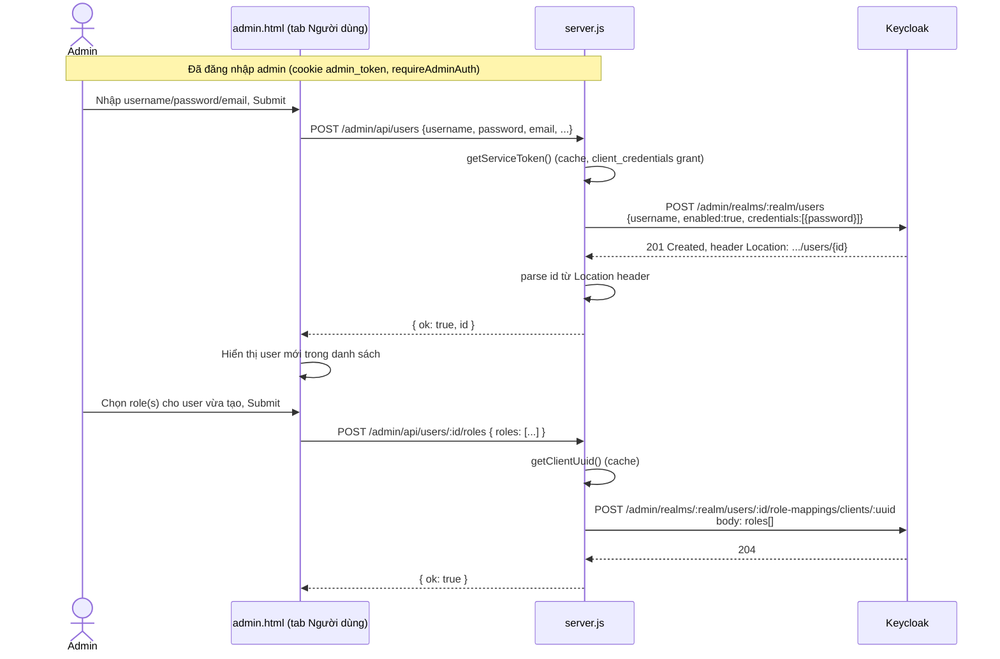
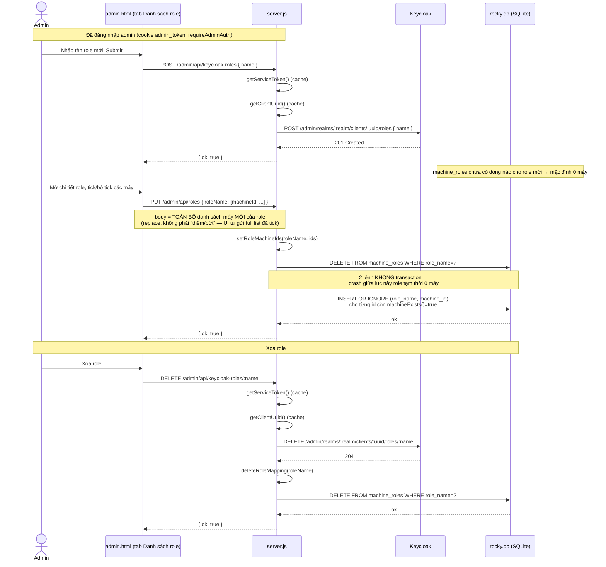

# Admin UI & Gateway (server.js + public/admin.html)

## Overview

Gateway Node.js (`server.js`) và giao diện quản trị web (`public/admin.html`) cho phép quản trị viên IT quản lý **máy trạm (machines)**, **vai trò (roles)** và **người dùng Keycloak**, đồng thời phục vụ luồng đăng nhập SSO và kiểm soát truy cập cho client ROCKY (`src/ui/ab.tis`). Dữ liệu máy trạm và ánh xạ role↔máy được lưu trong SQLite (`data/rocky.db`) thông qua module built-in `node:sqlite` — không có npm dependency.

## Key Files

| File | Vai trò |
|---|---|
| `server.js` | HTTP server: Admin REST API, OIDC auth proxy với Keycloak, endpoint kiểm soát truy cập, lớp truy cập SQLite |
| `public/admin.html` | SPA quản trị: 3 tab Người dùng / Danh sách role / Danh sách máy |
| `data/rocky.db` | SQLite database (tự sinh khi chạy `node server.js` lần đầu) |
| `data.json` | File JSON lịch sử — chỉ đọc một lần để migrate sang `data/rocky.db` nếu DB còn rỗng, sau đó không còn được dùng |
| `src/ui/ab.tis` | Client Sciter — gọi `/api/address-books`, `/api/check-access`, hiển thị danh sách máy theo role |

## Flow

### Schema SQLite

```sql
CREATE TABLE machines (
  id          TEXT PRIMARY KEY,
  alias       TEXT NOT NULL DEFAULT '',
  rustdesk_id TEXT NOT NULL DEFAULT '',
  note        TEXT NOT NULL DEFAULT ''
);
CREATE TABLE machine_roles (
  role_name  TEXT NOT NULL,
  machine_id TEXT NOT NULL,
  PRIMARY KEY (role_name, machine_id)
);
```

Không có cột `tag` (đã bỏ khỏi mô hình máy trạm — xem Change Log). Quan hệ N–N giữa role và máy lưu trực tiếp trong `machine_roles`.

### Lớp truy cập dữ liệu trong `server.js`

| Hàm | Việc làm |
|---|---|
| `getAllMachines()` | Lấy toàn bộ máy, gắn thêm `roles: [...]` cho mỗi máy |
| `getMachineById(id)` / `getMachineByRustdeskId(rid)` | Tra cứu 1 máy |
| `insertMachine()` / `updateMachine()` / `deleteMachine()` | CRUD máy (xóa máy tự xóa luôn các dòng `machine_roles` liên quan) |
| `setMachineRoles(machineId, roleNames)` | Ghi lại toàn bộ role của 1 máy |
| `getRolesMap()` | `{roleName: [machineId,...]}` — dùng cho `GET /admin/api/roles` |
| `setRoleMachineIds(roleName, ids)` | Ghi lại toàn bộ máy thuộc 1 role — dùng cho `PUT /admin/api/roles` |
| `deleteRoleMapping(roleName)` | Xóa toàn bộ mapping của 1 role (khi xóa KC role) |
| `getMachinesForRoles(roleNames)` | Trả về máy (kèm `roles`) mà ít nhất 1 role trong danh sách có quyền — dùng cho `/api/check-access` và `/api/address-books` |

### Migration một lần từ `data.json`

Khi khởi động, `migrateFromJsonIfNeeded()` kiểm tra `SELECT COUNT(*) FROM machines`:
- Nếu > 0 → bỏ qua (đã có dữ liệu, không migrate lại).
- Nếu = 0 và `data.json` tồn tại → đọc từng `machine` (bỏ field `tag`) và từng `roles[roleName] = [...]` để insert vào 2 bảng.
- Nếu = 0 và không có `data.json` → seed 3 máy demo.

### Luồng kiểm soát truy cập / Address Book (không đổi về API contract)

```
ROCKY client (ab.tis / ui.rs)
    │ POST /api/check-access {rustdesk_id} + Bearer token
    │ POST /api/address-books            + Bearer token
    ▼
server.js: decode JWT → roles → getMachinesForRoles(roles)
    ▼
SQLite (machines ⨝ machine_roles)
```

`/api/address-books` trả về mỗi machine kèm field `roles: [...]` (role Keycloak được gán cho máy đó) — `ab.tis` dùng field này để dựng panel filter bên trái Address Book (trước đây dựng từ `tag`, nay dựng từ `roles`).

### Luồng tạo user + gán role (Admin UI)



Điểm chú ý:
- `getServiceToken()` lấy access token cho **chính server.js** qua `client_credentials` grant (service account của client `rustdesk-client`, quyền `realm-management`) — vì phiên đăng nhập admin (`admin_token` cookie) là auth nội bộ của gateway, không sinh ra token Keycloak nào để forward.
- `getClientUuid()` tra `clientId="rustdesk-client"` ra **UUID nội bộ** của Keycloak — các endpoint role-mapping (`/users/:id/role-mappings/clients/:uuid`) đòi UUID này, không nhận `clientId` dạng chuỗi.
- Cả hai đều cache ở biến module-level (`serviceToken`, `cachedClientUuid`), chỉ gọi lại Keycloak khi token hết hạn hoặc lần đầu khởi động.
- Role mapping của user lưu **hoàn toàn ở Keycloak**, không lưu trong `data/rocky.db`.
- Tạo user và gán role là **2 request riêng, không transaction**: nếu bước gán role lỗi sau khi tạo user thành công, user tồn tại trên Keycloak nhưng chưa có role nào — admin phải tự gán lại từ UI.

### Luồng tạo Keycloak role + map role↔máy



Điểm chú ý:
- Role **tồn tại** ở Keycloak (`clients/:uuid/roles`), nhưng **role↔máy** chỉ lưu ở SQLite (`machine_roles`) — 2 nguồn dữ liệu tách biệt, được gộp lại khi đọc ở `GET /admin/api/roles`.
- `PUT /admin/api/roles`: body là **toàn bộ danh sách máy mới** của role đó (UI tự tick rồi gửi full list) — server không tính diff, chỉ `DELETE` hết mapping cũ rồi `INSERT` lại theo danh sách mới (`setRoleMachineIds`, `server.js:161-167`). 2 câu SQL này **không nằm trong transaction** — nếu crash giữa lúc đó, role tạm thời còn 0 máy cho tới khi admin submit lại.
- Xoá role: thứ tự là **xoá ở Keycloak trước, xoá mapping SQLite sau** — 2 lệnh tách biệt, không transaction. Nếu tiến trình chết giữa 2 bước, `machine_roles` còn sót dòng tham chiếu tới role đã không còn tồn tại trên Keycloak; vì `GET /admin/api/roles` chỉ liệt kê role theo nguồn Keycloak (`kcRolesList`) nên dòng rác này không hiện ra ở UI, nhưng vẫn tồn đọng trong DB tới khi được dọn bằng tay.

## Change Log

- **2026-06-19** — Sau 1 lần tăng sáng navy vẫn bị phản hồi "còn tối", chuyển hẳn
  `:root` của `public/admin.html` sang **theme sáng** (nền trắng/xanh rất nhạt `#F7FAFF`,
  card trắng, chữ navy đậm `#16234F`, accent teal đậm `#00B8B8` thay vì navy/teal tối)
  thay vì chỉ đẩy sáng navy. Vì toàn bộ rule CSS + style inline trong JS đều tham chiếu
  qua `var(--bg/--surface/--surface-2/--accent/--accent-2/--text/--text-muted/--border/
  --danger/--danger-strong/--success)`, đổi theme chỉ cần sửa 11 giá trị trong `:root`
  — không phải sửa từng rule. Đồng thời chỉnh lại box-shadow/overlay từ đen thuần
  (`rgba(0,0,0,..)`) sang navy nhạt (`rgba(22,35,79,..)`) cho hợp tông sáng, và đổi badge
  xanh lá/đỏ sang tint nhạt + chữ đậm màu kiểu pill (chuẩn light-theme admin UI).
- **2026-06-19** — Nhúng logomark (PNG crop từ ảnh thương hiệu, base64 qua biến JS
  `LOGO_DATA_URI`) vào `` ở login card và
  `` ở header — `server.js` chỉ serve riêng `admin.html`
  qua `GET /admin` (không có route static file chung cho `public/`), nên ảnh phải nhúng
  base64 trực tiếp thay vì trỏ `src` ra file riêng.
- **2026-06-19** — Đổi theme `public/admin.html` từ nền sáng (xanh dương `#1565C0`) sang
  theme nền navy đậm/teal, đồng bộ với bộ nhận diện thương hiệu mới của app (xem CLAUDE.md
  mục "Rebrand: ROCKY + Navy/Teal Theme"). Khai báo 1 bộ CSS custom property (`--bg`,
  `--surface`, `--surface-2`, `--accent`, `--accent-2`, `--text`, `--text-muted`,
  `--border`, `--danger`, `--success`) trong `:root` rồi cho toàn bộ rule CSS + style
  inline trong JS tham chiếu qua `var(...)` thay vì hardcode hex — kể cả các đoạn
  HTML/inline style do JS sinh ra (badge, modal, checkbox accent-color…). Banner cảnh báo
  màu vàng (`#fff3cd`/`#ffc107`/`#856404`) giữ nguyên vì là alert tự chứa màu, không phụ
  thuộc theme nền. Thêm tagline "Think Like Hustler." dưới tiêu đề ở trang đăng nhập.
- **2026-06-19** — Thêm 2 sequence diagram (mermaid) vào mục Flow: "Luồng tạo user + gán role" và "Luồng tạo Keycloak role + map role↔máy" (gồm cả nhánh xoá role). Không có thay đổi code — chỉ bổ sung tài liệu rà soát luồng quản trị (admin.html → server.js → Keycloak Admin API / SQLite), kèm các rủi ro phát hiện: 2 request tạo-user/gán-role không transaction; `PUT /admin/api/roles` ghi đè toàn bộ mapping (không merge) và 2 câu SQL `DELETE`+`INSERT` không transaction; xoá role là 2 lệnh tách biệt (Keycloak rồi SQLite) có thể để sót mapping rác nếu crash giữa 2 bước.

- **2026-06-18** — Sửa lỗi client build từ CI/CD (.exe) không kết nối được tới Keycloak/gateway chạy
  trên máy ảo riêng. Hai nguyên nhân:
  1. `server.js` gọi `.listen(3000, '127.0.0.1', ...)` — chỉ chấp nhận kết nối từ chính máy đang chạy
     gateway, từ chối mọi kết nối từ máy khác trong mạng (dù client trỏ đúng IP vẫn bị reset/timeout).
     → đổi thành `.listen(3000, '0.0.0.0', ...)`.
  2. Toàn bộ URL gọi gateway hardcode `127.0.0.1:3000`/`localhost:8080`, chỉ đúng khi client và gateway
     chạy chung máy. Khi `.exe` build từ CI chạy trên máy Windows khác với VM chứa Keycloak + server.js,
     `127.0.0.1` trên máy Windows không trỏ tới VM. → đổi toàn bộ sang địa chỉ mạng thật của VM
     (`192.168.1.16`) tại: `server.js` (`KEYCLOAK_URL`, `REDIRECT_URI`), `src/ui.rs:508`
     (`check_access_blocking`), `src/ui/ab.tis` (`loginWithKeycloak`, `pollKeycloakAuth`,
     `getAddressBooks`, `logoutFromKeycloak`).
  Nếu đổi địa chỉ VM sau này, phải sửa đồng bộ cả 6 vị trí trên — chưa tham số hóa qua file config.

- **2026-06-17** — Thay `data.json` (JSON phẳng) bằng SQLite (`data/rocky.db`, qua `node:sqlite`) làm persistence chính cho `machines` + `machine_roles`. Giữ `data.json` làm migrate-source một lần, không xóa.
- **2026-06-17** — Bỏ hoàn toàn trường `tag` khỏi mô hình máy trạm: schema DB, `GET/POST/PUT /admin/api/machines`, `GET /admin/api/roles`, và toàn bộ UI quản lý máy/role trong `public/admin.html`.
- **2026-06-17** — `src/ui/ab.tis` (`getAddressBooks()`): panel filter "Tags" bên trái Address Book nay dựng từ `machine.roles` (trả về từ `/api/address-books`) thay cho `machine.tag` đã bị xóa. Hành vi filter/chọn tag trong UI không đổi, chỉ đổi nguồn dữ liệu.
- **2026-06-17** — Vá lỗi tồn đọng tại `POST /api/check-access`: handler tham chiếu biến `body` chưa từng được đọc từ request (do `readBody`/`JSON.parse` trước đó chỉ chạy trong nhánh `/admin/api/*`), khiến endpoint luôn lỗi và phụ thuộc hoàn toàn vào timeout 800ms phía client (failopen). Đã thêm đọc/parse body riêng cho endpoint này.
