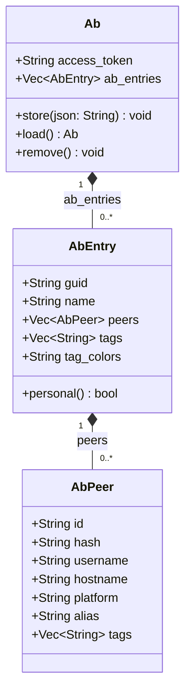
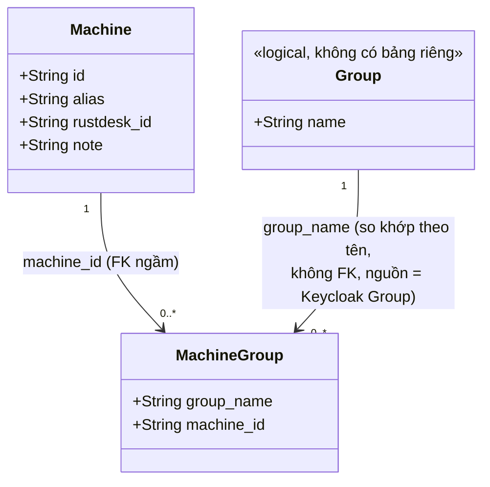
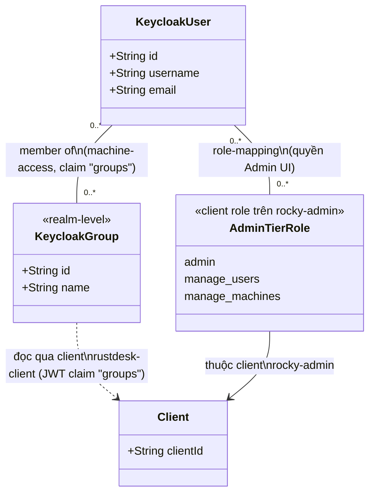

# Tổng hợp Class Diagram — ROCKY

## Overview

File này gom các class diagram (mermaid) mô tả **data model** của ROCKY — tương tự cách
`docs/sequenceDiagram.md` gom các sequence diagram. Có 3 lớp model tách biệt, không dùng
chung 1 database hay 1 ngôn ngữ:

1. **Address Book local cache** (Rust, `libs/hbb_common/src/config.rs`) — model gốc của
   RustDesk, lưu mã hoá+nén trên máy client.
2. **Gateway persistence** (Node.js + SQLite, `server.js` / `data/rocky.db`) — model máy
   trạm + mapping Group↔máy do ROCKY tự xây.
3. **Keycloak permission model** (conceptual — không phải class Rust/JS thật, mô tả thực
   thể trên Keycloak mà 2 model trên phụ thuộc vào) — User, Group, Role.

**File này KHÔNG phải nguồn chính.** Struct/schema thật nằm ở file code tương ứng (ghi rõ
trên mỗi diagram); khi đổi field/cột, sửa code trước rồi đồng bộ lại diagram ở đây.

## Danh sách biểu đồ

| # | Diagram | Nguồn | Loại |
|---|---|---|---|
| 1 | Address Book local cache (`Ab`/`AbEntry`/`AbPeer`) | `libs/hbb_common/src/config.rs:2452-2578` | Rust struct |
| 2 | Gateway machine/group persistence (SQLite) | `server.js:43-190` | SQL schema + JS helper |
| 3 | Keycloak permission model (conceptual) | `server.js` (gọi Keycloak Admin/Auth API), `docs/admin-ui.md`, `docs/address-book.md` | Conceptual |

---

## 1. Address Book local cache (`Ab` / `AbEntry` / `AbPeer`)

> Nguồn: [`libs/hbb_common/src/config.rs:2452-2578`](../libs/hbb_common/src/config.rs)

Model gốc của RustDesk, không đổi khi ROCKY thêm lớp Keycloak/gateway. Đây là cấu trúc
được serialize/deserialize ra JSON, lưu **local** (mã hoá + nén bằng `symmetric_crypt`/
`compress`, file `{APP_NAME}_ab`) và là body gửi lên `POST /api/ab` (cơ chế ghi gốc, xem
`docs/address-book.md`).

Điểm chú ý:
- `Ab` là root object — chỉ chứa `access_token` (đặt tên trùng nhưng **độc lập** với
  `access_token` Keycloak lưu qua `LocalConfig::set_option`, xem rủi ro đã ghi nhận ở
  `docs/address-book.md`) + danh sách `AbEntry`.
- `AbEntry.personal()` trả `true` nếu `name` là `"My address book"` hoặc
  `"Legacy address book"` — đây là cách duy nhất phân biệt "address book cá nhân" với
  address book chia sẻ, không có field `is_personal` riêng.
- Trong nhánh ROCKY hiện tại, dữ liệu **đọc** để hiển thị panel Address Book không lấy từ
  cấu trúc này nữa mà lấy trực tiếp từ `GET/POST /api/address-books` (diagram #2 dưới) —
  struct này vẫn tồn tại cho cơ chế **ghi** gốc (`updateAb()` ở `ab.tis`) và để tương thích
  ngược với format AB gốc của RustDesk.
- Mọi field `String` đều dùng `deserialize_with = "deserialize_string"` +
  `skip_serializing_if = "String::is_empty"` (bỏ qua khi rỗng để JSON gọn) — không thể
  hiện trong diagram vì là chi tiết serde, không phải shape dữ liệu.

---

## 2. Gateway machine/group persistence (SQLite `rocky.db`)

> Nguồn: [`server.js:43-190`](../server.js)

Model do ROCKY tự xây để quản lý máy trạm + mapping Group↔máy, tách biệt hoàn toàn khỏi
model `Ab` ở trên. `Group` không có bảng riêng trong SQLite — nó chỉ là một `TEXT` (tên
group) tham chiếu sang Keycloak Group thật (diagram #3), nối qua `machine_groups.group_name`
mà không có foreign key constraint nào (so khớp theo tên, không theo ID).

Hàm truy cập dữ liệu tương ứng (tất cả trong `server.js`):

| Hàm | Việc làm |
|---|---|
| `getAllMachines()` / `attachGroups()` | Lấy toàn bộ `Machine`, gắn thêm `groups: [...]` từ `machine_groups` |
| `getMachineById(id)` / `getMachineByRustdeskId(rid)` | Tra cứu 1 `Machine` |
| `machineExists(id)` | Kiểm tra tồn tại trước khi insert mapping |
| `insertMachine()` / `updateMachine()` / `deleteMachine()` | CRUD `Machine` — `deleteMachine()` xoá luôn `MachineGroup` liên quan |
| `setMachineGroups(machineId, groupNames)` | Ghi lại toàn bộ `MachineGroup` của 1 `Machine` (replace, không merge) |
| `getGroupsMap()` | `{groupName: [machineId,...]}` |
| `setGroupMachineIds(groupName, ids)` | Ghi lại toàn bộ `MachineGroup` của 1 `Group` (replace, không merge) |
| `deleteGroupMapping(groupName)` | Xoá toàn bộ `MachineGroup` của 1 `Group` |
| `getMachinesForGroups(groupNames)` | `Machine` mà ≥1 `Group` trong danh sách có quyền |

Điểm chú ý:
- `MachineGroup` là bảng join N-N kinh điển, primary key composite `(group_name,
  machine_id)` — không có cột `id` riêng.
- **Không có transaction** ở `setMachineGroups`/`setGroupMachineIds` (2 câu SQL
  `DELETE` rồi `INSERT` tách biệt) — đã ghi nhận rủi ro race/crash-giữa-2-bước ở
  `docs/admin-ui.md`.
- `Group.name` không tồn tại độc lập trong SQLite — một dòng `MachineGroup` với
  `group_name` trỏ tới Group đã bị xoá trên Keycloak vẫn có thể tồn đọng trong DB nếu
  `deleteGroupMapping()` không được gọi đúng lúc (xem Change Log `docs/admin-ui.md`).

---

## 3. Keycloak permission model (conceptual)

> Nguồn: không phải class code thật — mô tả thực thể Keycloak mà `server.js` đọc/ghi qua
> Keycloak Admin REST API + JWT claims. Tổng hợp từ `docs/admin-ui.md` và
> `docs/address-book.md`.

Có **2 hệ phân quyền độc lập, không liên quan nhau**, cùng tồn tại trên 1 Keycloak realm
(`rustdesk`):

Điểm chú ý:
- **Hệ 1 — machine-access (Rocky desktop client)**: `KeycloakUser` ↔ `KeycloakGroup`
  (realm-level, N-N qua Keycloak group membership). Gateway đọc qua claim `groups` trong
  access token (`getGroupsFromPayload()`) — **không** gọi thêm Keycloak Admin API mỗi
  request. `KeycloakGroup.name` chính là `MachineGroup.group_name` ở diagram #2 (so khớp
  theo string, không phải FK thật — 2 hệ thống tách biệt).
- **Hệ 2 — Admin UI tier (`rocky-admin` client)**: `KeycloakUser` ↔ `AdminTierRole`
  (client role mapping, 3 giá trị cố định `admin`/`manage_users`/`manage_machines`).
  Gateway đọc qua introspection (`getRolesFromPayload(introspection, "rocky-admin")`)
  sau khi xác thực `/admin/login`.
- 2 hệ này **dùng chung 1 user Keycloak** nhưng hoàn toàn độc lập về dữ liệu phân quyền —
  một user có thể vừa thuộc `KeycloakGroup` "phong-ke-toan" (để thấy máy trong Address
  Book) vừa có `AdminTierRole` "manage_machines" (để vào Admin UI quản lý máy), 2 quan hệ
  không ảnh hưởng nhau.
- `decodeJwtPayload()`/introspection đều **không verify lại chữ ký JWT bằng JWKS** ở phía
  gateway khi đọc claim — rủi ro đã ghi nhận ở `docs/address-book.md`.

## Change Log

- **2026-06-21** — Tạo file, vẽ 3 class diagram: (1) `Ab`/`AbEntry`/`AbPeer` từ
  `libs/hbb_common/src/config.rs`, (2) `Machine`/`MachineGroup` từ schema SQLite trong
  `server.js`, (3) model conceptual Keycloak (`KeycloakUser`/`KeycloakGroup`/
  `AdminTierRole`/`Client`) tổng hợp từ `docs/admin-ui.md` + `docs/address-book.md`. Không
  có thay đổi code.
