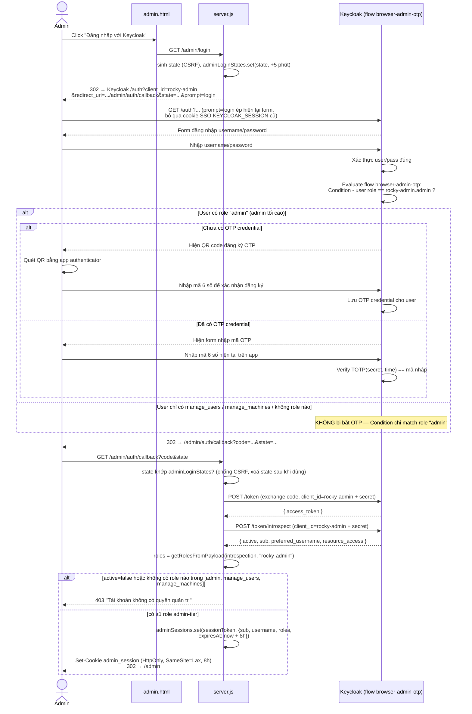

# Keycloak — Xác thực, 2FA, Phân quyền & Cấu hình (ROCKY)

## Overview

ROCKY dùng **1 Keycloak realm duy nhất (`rustdesk`)** làm Identity Provider cho **2 hệ
thống hoàn toàn tách biệt**, mỗi hệ có client OAuth2 riêng, flow riêng, và mô hình phân
quyền riêng — chỉ chung 1 chỗ là cùng đăng nhập user/password trên cùng Keycloak:

| | Client ROCKY desktop (Address Book) | Admin Web UI |
|---|---|---|
| Keycloak client | `rustdesk-client` | `rocky-admin` |
| File entry point | `src/ui/ab.tis`, `src/ui.rs` | `public/admin.html` |
| Grant | Authorization Code (qua tab browser hệ thống, polling) | Authorization Code (redirect trực tiếp, web) |
| 2FA | Không | **Có — chỉ cho role `admin` (admin tối cao)** |
| Verify token | `decodeJwtPayload()` — **không** verify signature | `introspectToken()` — Keycloak tự verify |
| Mô hình phân quyền | Keycloak **Group** (realm-level) — machine-access | Keycloak **client role** trên `rocky-admin` (3 tier) |
| Session phía gateway | `LocalConfig` (client) / `sessions` Map (server.js, theo `session_code`) | `adminSessions` Map (server.js, TTL cố định 8h) |
| Logout | Revoke token (fire-and-forget, có thể silent-fail) | **Global SSO logout** (redirect Keycloak end-session) |

File này tổng hợp lại toàn bộ phần Keycloak từ `docs/address-book.md`, `docs/admin-ui.md`,
`.claude/plans/admin-login-keycloak-sso.md` và mục "Web Admin UI" trong `CLAUDE.md` vào
một chỗ, tập trung riêng vào khía cạnh Keycloak (xác thực, 2FA, cấu hình) — **không** thay
thế các file đó, vẫn nên đọc kèm để biết chi tiết luồng nghiệp vụ xung quanh (UI render,
SQLite, Address Book data model...).

## Key Files

| File | Vai trò liên quan tới Keycloak |
|---|---|
| `server.js:9-32` | Hằng số cấu hình 2 client (`CLIENT_ID`/`CLIENT_SECRET`, `ADMIN_CLIENT_ID`/`ADMIN_CLIENT_SECRET`), `VM_HOST`/`KEYCLOAK_HOST`, 3 hằng số role admin-tier |
| `server.js:233-250` | `getServiceToken()` — service account token (`client_credentials` grant, dùng `rustdesk-client`) cho mọi gọi Keycloak Admin REST API |
| `server.js:252-259` | `getClientUuid(clientId)` — tra UUID nội bộ Keycloak của 1 client, cache theo `Map` |
| `server.js:261-292` | `decodeJwtPayload()`, `getRolesFromPayload()`, `getGroupsFromPayload()` — đọc claim từ JWT (không verify signature) |
| `server.js:294-299` | `introspectToken()` — verify token qua Keycloak (dùng riêng cho Admin UI) |
| `server.js:301-313` | `buildKeycloakLogoutUrl()`, `renderAdminAuthError()` |
| `server.js:331-363` | `requireAdminAuth()`, `requireSuperAdmin()` — gate route Admin API theo tier |
| `server.js:365-411` | `keycloakAdminGet/Post`, `listGroups/createGroup/deleteGroupById/getGroupMembers/addUserToGroup/removeUserFromGroup` — gọi Keycloak Admin REST API |
| `server.js:433-532` | Route `/admin/login`, `/admin/auth/callback`, `/admin/session`, `/admin/logout` — luồng login/logout Admin UI |
| `server.js:~830-930` | Route `/api/auth/init`, `/api/auth/callback`, `/api/auth/status`, `/api/auth/logout` — luồng login/logout client ROCKY desktop |
| `src/ui/ab.tis` | `loginWithKeycloak()`, `pollKeycloakAuth()`, `logoutFromKeycloak()` |
| `src/ui.rs:497-528` | `check_access_blocking` — Rust tự gọi `POST /api/check-access` kèm Bearer token |
| `.claude/plans/admin-login-keycloak-sso.md` | Plan gốc thiết kế luồng login + 2FA cho Admin UI, có sequence diagram thiết kế ban đầu + log cấu hình Keycloak thật đã làm |

## Cấu hình Realm & Client (đã thực hiện trên Keycloak Admin Console)

### Realm
- Tên realm: **`rustdesk`**.

### Client 1 — `rustdesk-client` (ROCKY desktop client)

| Thuộc tính | Giá trị |
|---|---|
| Access Type | Confidential (có `client_secret`) |
| Standard Flow (Authorization Code) | Enabled |
| Valid Redirect URI | `http://{VM_HOST}/api/auth/callback` |
| Service Accounts Roles | **Enabled** — gán role từ `realm-management`: `view-users`, `manage-users`, `view-realm`, `query-groups` (fallback thêm `manage-realm` nếu vẫn 403 khi tạo Group) |
| Protocol Mapper | **"Group Membership"** — Token Claim Name = `groups` (⚠️ phải điền, không để trống — xem gotcha ở mục Rủi ro), Full group path = **OFF**, Add to access token = **ON** |
| Authentication flow (Browser) | Flow **gốc**, không có Conditional OTP — user thường không bị bắt 2FA |

Service account của client này được dùng làm "danh tính kỹ thuật" cho **mọi** lệnh gọi
Keycloak Admin REST API trong `server.js` (cả từ phía Admin UI lẫn phía machine-access) —
qua `getServiceToken()`. Đây là 1 điểm tập trung: nếu `CLIENT_SECRET` của
`rustdesk-client` bị lộ, kẻ tấn công có quyền quản trị Keycloak tương đương service
account đó (xem mục Rủi ro).

### Client 2 — `rocky-admin` (Admin Web UI)

| Thuộc tính | Giá trị |
|---|---|
| Access Type | Confidential (có `client_secret`) |
| Standard Flow (Authorization Code) | Enabled |
| Valid Redirect URI | `http://{VM_HOST}/admin/auth/callback` |
| **Valid post logout redirect URIs** | `http://{VM_HOST}/admin` (bắt buộc — thiếu sẽ lỗi `400 Invalid redirect uri` khi logout, xem Change Log) |
| Client roles | 3 role admin-tier: `admin` (admin tối cao), `manage_users`, `manage_machines` |
| Authentication flow (Browser) override | Flow tuỳ biến **`browser-admin-otp`** (duplicate từ flow `Browser` gốc) — riêng cho client này, **không ảnh hưởng `rustdesk-client`** |

#### Cấu trúc flow `browser-admin-otp` (2FA)

```
browser-admin-otp forms (Alternative)
├─ Username Password Form (Required)
└─ browser-admin-otp Browser - Conditional 2FA (Conditional)
   ├─ Condition - user role (Required) → role = rocky-admin.admin
   ├─ OTP Form (Required)
   ├─ WebAuthn Authenticator (Disabled)
   └─ Recovery Authentication Code Form (Disabled)
```

- Điều kiện 2FA là **role**, không phải "user đã từng cấu hình OTP" (giá trị mặc định
  Keycloak sinh ra khi duplicate flow là `Condition - user configured`, đã bị xoá và thay
  vì nó dễ gây hiểu nhầm: với điều kiện đó, user admin **mới tạo, chưa từng cấu hình OTP**
  sẽ **không** bao giờ bị bắt cấu hình OTP — sai mục tiêu "bắt buộc 2FA cho admin").
- 2FA = **TOTP qua app authenticator** (Google Authenticator/Authy/Keycloak app) — built-in
  Keycloak core, không cần SMTP/SMS gateway, không cần dependency thêm.
- Flow này được gán làm **Browser Flow override** riêng cho client `rocky-admin` (tab
  Advanced của client trong Keycloak Admin Console) — client `rustdesk-client` vẫn dùng
  flow `Browser` mặc định của realm.

## Flow — Xác thực

### 1. Login client ROCKY desktop (không 2FA)

Xem chi tiết đầy đủ (kèm sequence diagram) ở [`docs/address-book.md`](address-book.md)
mục "1. Login" / [`docs/sequenceDiagram.md`](sequenceDiagram.md) diagram #1. Tóm tắt:
`ab.tis` gọi `POST /api/auth/init` → `server.js` redirect user qua browser hệ thống tới
Keycloak `/auth` (client `rustdesk-client`, `prompt=login`) → user nhập user/pass (không
OTP) → Keycloak redirect về `GET /api/auth/callback` → `server.js` đổi `code` lấy
`access_token` qua `POST /token` → lưu tạm trong `sessions` Map theo `session_code` →
`ab.tis` poll `POST /api/auth/status` lấy token về, lưu vào `LocalConfig` qua Rust.

Token này được tự decode bằng `decodeJwtPayload()` (**không verify signature**) để lấy
claim `groups`, dùng cho mục "Phân quyền" dưới đây.

### 2. Login Admin UI (Authorization Code + 2FA Conditional OTP)

Diagram chi tiết nhánh OTP (bổ sung so với bản tóm lược ở `docs/admin-ui.md`, phản ánh
đúng code hiện tại — kiểm tra **3 role admin-tier**, không chỉ riêng `admin`):



Điểm chú ý:
- **2FA chỉ áp dụng cho role `admin` (admin tối cao)** — `manage_users`/`manage_machines`
  đăng nhập được vào Admin UI mà **không** bị bắt OTP. Đây là quyết định từ lúc thiết kế
  ban đầu (chỉ có 1 role `admin` duy nhất); sau khi mở rộng thành 3-tier
  (`docs/admin-ui.md` Change Log 2026-06-21), **chưa có quyết định/cấu hình lại** để mở
  rộng OTP cho 2 tier mới — xem mục Rủi ro.
- `prompt=login` (cả ở `/admin/login` và `/api/auth/init`) ép Keycloak luôn hiện lại form
  username/password, **không** tái dùng cookie SSO `KEYCLOAK_SESSION` của browser — tránh
  bug "đăng nhập nhầm tài khoản đang có session SSO khác" (xem `docs/admin-ui.md` Change
  Log 2026-06-20).
- Verify token bằng **token introspection** (`POST /token/introspect`), không phải
  `decodeJwtPayload()` tự decode — vì đây là gate cho hành động quản trị nhạy cảm, cần
  Keycloak tự verify signature + expiry thật, không chấp nhận rủi ro JWT giả như ở luồng
  client.
- Session Admin UI (`adminSessions` Map) có **TTL cố định 8 giờ kể từ lúc login**, độc lập
  với thời gian sống ngắn (~300s) của `access_token` Keycloak — vì sau bước introspect ban
  đầu, `server.js` không cần dùng lại `access_token` của user (mọi gọi Keycloak Admin API
  sau đó dùng service account riêng của `rustdesk-client` qua `getServiceToken()`).

### 3. Logout — khác nhau giữa 2 hệ

| | Client ROCKY desktop | Admin UI |
|---|---|---|
| Cơ chế | `POST /protocol/openid-connect/revoke` (server-to-server, fire-and-forget) | Redirect browser tới `/protocol/openid-connect/logout` (global SSO end-session) |
| Kết thúc session SSO trong browser? | **Không** — chỉ revoke access_token đó, cookie SSO Keycloak vẫn còn | **Có** — đúng nghĩa "global SSO logout", lần mở `/admin` sau phải đăng nhập lại từ đầu |
| Có thể silent-fail? | **Có** — server chỉ `console.error`, luôn trả `{ok:true}` cho client dù revoke lỗi (xem `docs/address-book.md` mục Logout) | Không silent — nếu thiếu "Valid post logout redirect URIs" sẽ lỗi rõ `400 Invalid redirect uri` ngay trên trang Keycloak |

## Flow — Mô hình phân quyền

Xem class diagram đầy đủ ở [`docs/classDiagram.md`](classDiagram.md) diagram #3. Tóm tắt:
**2 hệ phân quyền độc lập, dùng chung 1 Keycloak user nhưng không liên quan dữ liệu**:

1. **Machine-access (Address Book, client `rustdesk-client`)** — theo **Keycloak Group**
   (realm-level). Gateway đọc claim `groups` trong access token
   (`getGroupsFromPayload()`), map sang máy qua SQLite `machine_groups`
   (`getMachinesForGroups()`). **Không verify signature JWT** ở bước này — chỉ là UX
   gate, đã ghi nhận fail-open khi gateway lỗi/offline (`docs/address-book.md`).
2. **Admin UI tier (client `rocky-admin`)** — theo **client role**, 3 giá trị cố định
   (`admin`/`manage_users`/`manage_machines`). Verify qua introspection (không fail-open
   — lỗi/timeout introspect sẽ là exception → 500, không cho qua). `requireAdminAuth()`
   gate theo tier ở từng route; `requireSuperAdmin()` riêng cho route chỉ admin tối cao.

## Checklist cấu hình Keycloak (khi setup server/realm mới)

1. Tạo realm `rustdesk`.
2. Tạo client `rustdesk-client` (confidential, Standard Flow, redirect URI
   `http://{VM_HOST}/api/auth/callback`).
   - Bật **Service Accounts Roles** → gán `view-users`, `manage-users`, `view-realm`,
     `query-groups` từ `realm-management` (thêm `manage-realm` nếu vẫn 403 khi tạo Group).
   - Thêm protocol mapper **"Group Membership"**: Mapper Type đúng là "Group Membership"
     (không phải "User/Client Role"), **Token Claim Name = `groups`** (không để trống —
     field "Name" chỉ là tên hiển thị, không quyết định claim key), Full group path =
     **OFF**, Add to access token = **ON**.
3. Tạo client `rocky-admin` (confidential, Standard Flow, redirect URI
   `http://{VM_HOST}/admin/auth/callback`, **Valid post logout redirect URIs**
   = `http://{VM_HOST}/admin`).
   - Tạo 3 client role: `admin`, `manage_users`, `manage_machines`.
   - Gán role `admin` cho **ít nhất 1 user** làm admin tối cao đầu tiên (bootstrap — chỉ
     admin tối cao mới gán được role admin-tier cho người khác qua chính Admin UI, nên cần
     gán tay lần đầu trực tiếp trên Keycloak Admin Console).
4. Cấu hình 2FA: Duplicate flow `Browser` → đặt tên `browser-admin-otp` → trong nhánh
   Conditional 2FA, xoá execution mặc định `Condition - user configured`, thêm
   `Condition - user role` = `rocky-admin.admin` (Required), đổi `OTP Form` từ
   `Alternative` → `Required`. Gán flow này làm **Browser Flow override** riêng cho client
   `rocky-admin` (tab Bindings/Advanced) — **không đổi** flow của `rustdesk-client`.
5. Tạo Keycloak Group (realm-level) cho machine-access, ví dụ `phong-ke-toan`,
   `phong-nhan-su` — gán user vào group qua Admin UI (tab "Người dùng" → "Gán group") hoặc
   trực tiếp trên Keycloak Admin Console.

## Rủi ro / Lưu ý đã ghi nhận

1. **2FA chỉ bind với role `admin`, chưa mở rộng cho `manage_users`/`manage_machines`**
   sau khi model chuyển từ 1-role sang 3-tier (2026-06-21) — user có 2 tier mới đăng nhập
   Admin UI **không** bị bắt OTP, dù vẫn có quyền quản trị thật (CRUD user/máy). Chưa có
   quyết định rõ ràng với user là có cố ý hay là gap cần vá — cần xác nhận lại nếu muốn
   siết 2FA cho cả 3 tier.
2. **`decodeJwtPayload()` không verify chữ ký JWT** (`server.js:261-269`) — dùng cho luồng
   client (`groups`, `check-access`), chấp nhận mọi token có cấu trúc đúng dù chữ ký giả.
   Luồng Admin UI **không** có rủi ro này vì dùng `introspectToken()` (Keycloak tự verify).
3. **1 service account duy nhất (`rustdesk-client`) cho mọi gọi Keycloak Admin API** —
   dùng chung cho cả thao tác Admin UI (tạo user, tạo Group...) và việc tự nó cũng là
   client của luồng machine-access. Lộ `CLIENT_SECRET` của `rustdesk-client` ảnh hưởng cả
   2 hệ.
4. **Token revoke ở luồng client là silent-fail** — `server.js` chỉ `console.error` khi
   Keycloak revoke lỗi, luôn trả `{ok:true}` cho `ab.tis` — token có thể vẫn hợp lệ ở
   Keycloak tới khi tự hết hạn dù app đã hiển thị như đã logout (chi tiết ở
   `docs/address-book.md` mục Logout).
5. **Cấu hình thiếu "Valid post logout redirect URIs" gây lỗi 400** khi global SSO logout
   — đã từng gặp thật khi test (`.claude/plans/admin-login-keycloak-sso.md`, mục Changelog
   2026-06-20 "phát hiện bug ở logout") — checklist cấu hình ở trên đã thêm bước này để
   tránh lặp lại.
6. **Mọi URL Keycloak/gateway hardcode theo `VM_HOST`/`KEYCLOAK_HOST` trong `server.js`**
   (không tham số hoá qua file config ngoài code) — đổi IP/mạng phải sửa đồng bộ nhiều vị
   trí, xem `docs/admin-ui.md` Change Log 2026-06-18.

## Change Log

- **2026-06-21** — Tạo file, tổng hợp toàn bộ cấu hình + luồng Keycloak (2 client, 2 mô
  hình phân quyền, 2FA Conditional OTP cho Admin UI) từ `docs/address-book.md`,
  `docs/admin-ui.md`, `.claude/plans/admin-login-keycloak-sso.md`, và mục "Web Admin UI"
  trong `CLAUDE.md`. Vẽ 1 sequence diagram mới (chi tiết nhánh đăng ký/nhập OTP trong
  luồng login Admin UI, cập nhật đúng theo code hiện tại — kiểm tra 3 role admin-tier,
  không chỉ riêng `admin` như bản thiết kế gốc trong plan) — đã đồng bộ thêm diagram này
  vào `docs/sequenceDiagram.md` (diagram #8) theo quy tắc Documentation trong `CLAUDE.md`.
  Phát hiện và ghi nhận 1 gap khi rà soát: 2FA hiện chỉ bind role `admin`, chưa mở rộng cho
  2 tier mới `manage_users`/`manage_machines` sau redesign 3-tier — chưa sửa code, chỉ ghi
  nhận để user quyết định. Không có thay đổi code nào trong lần tạo file này.
