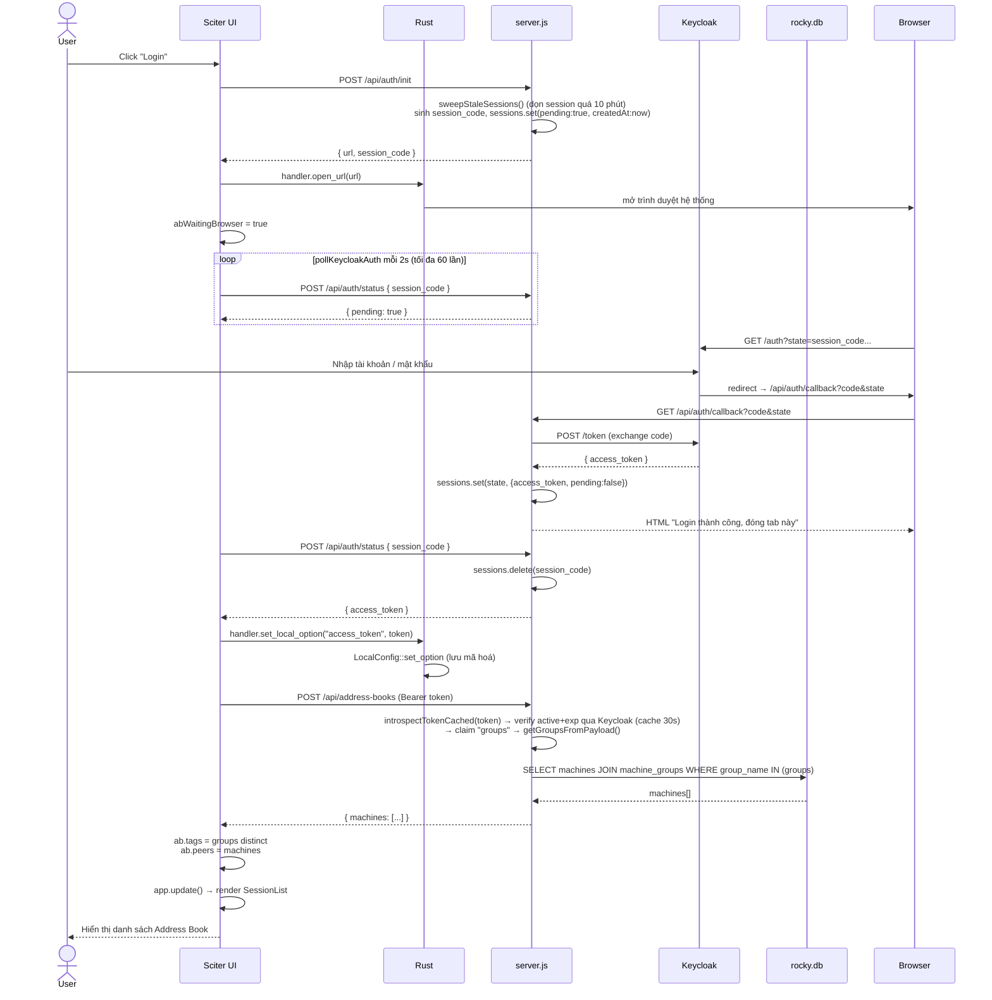
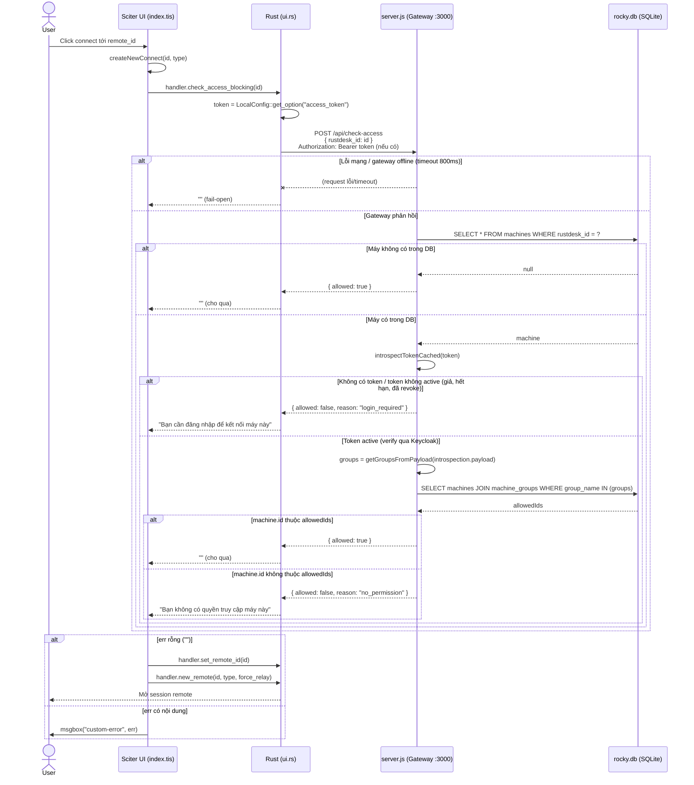
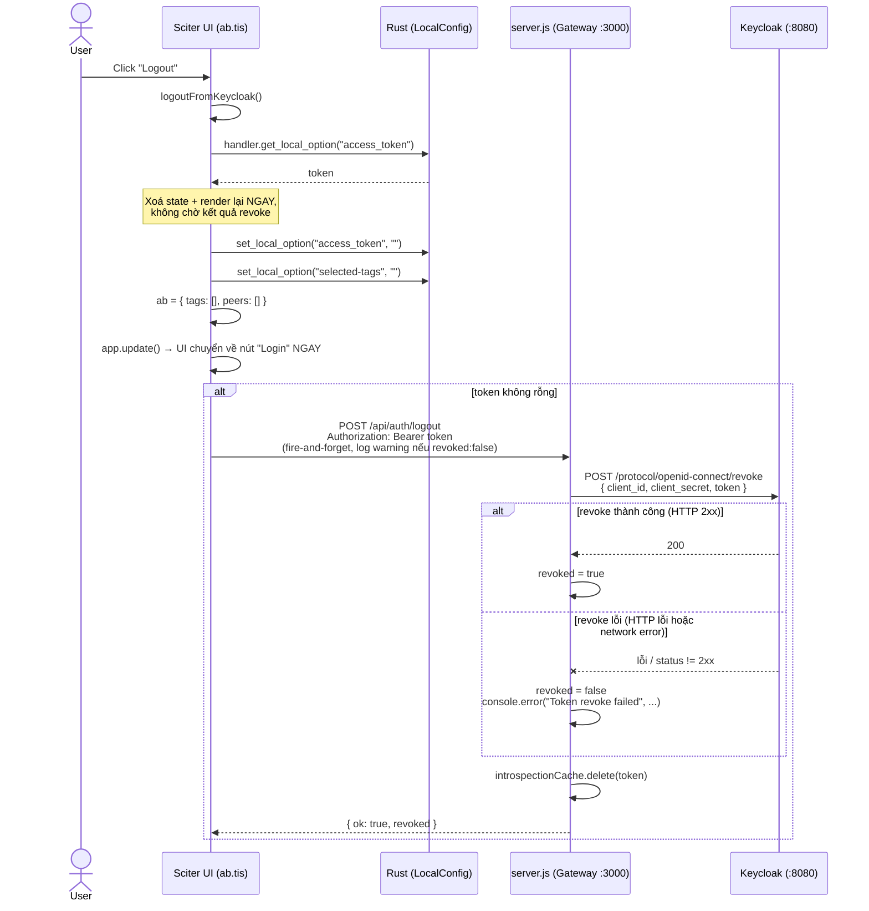
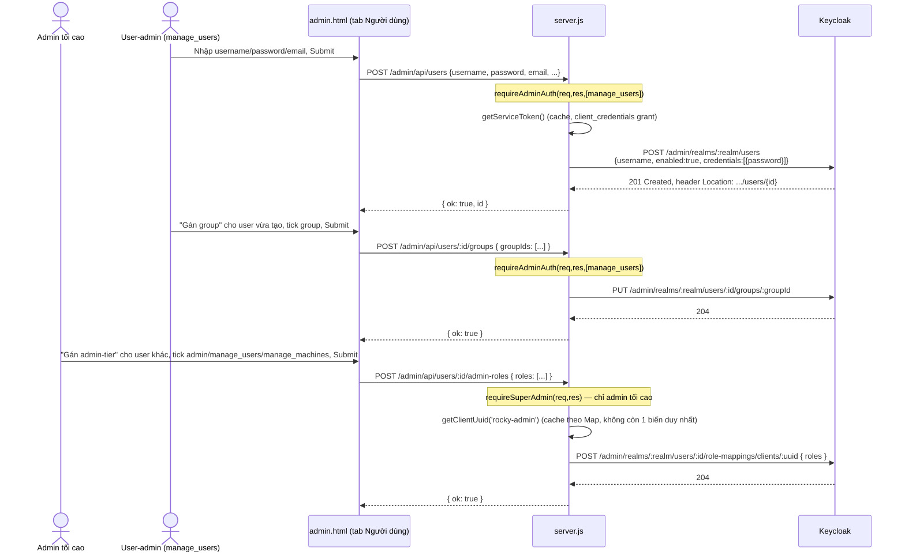
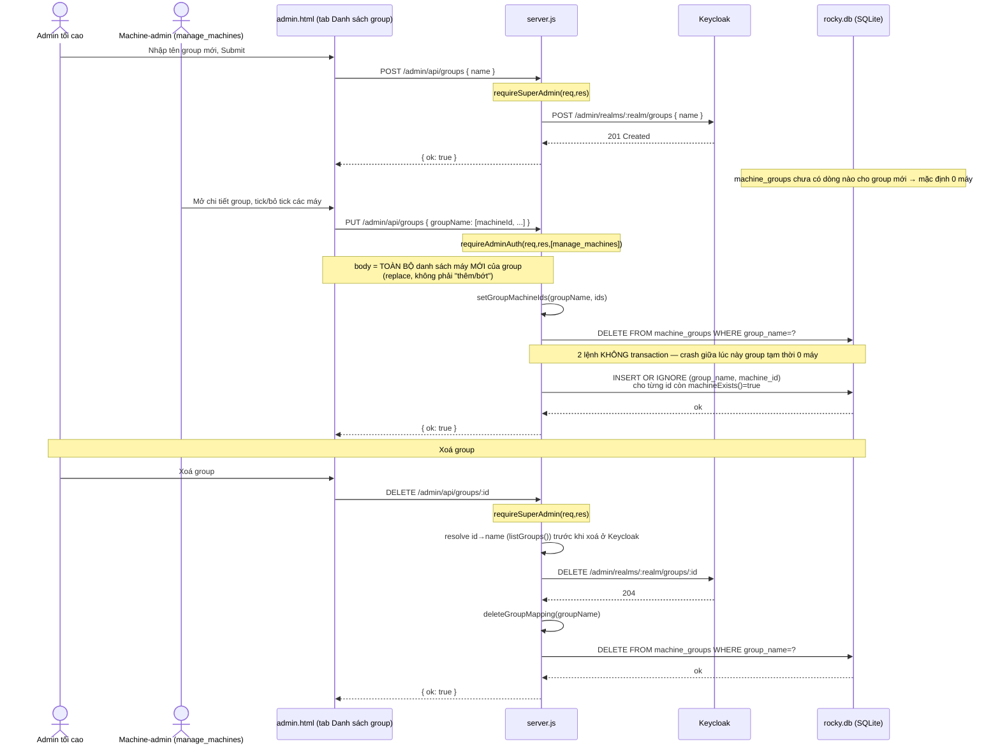
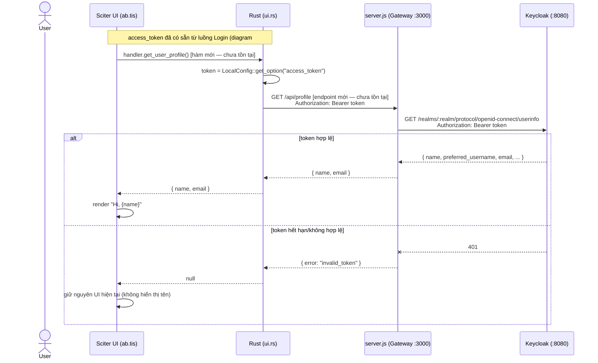
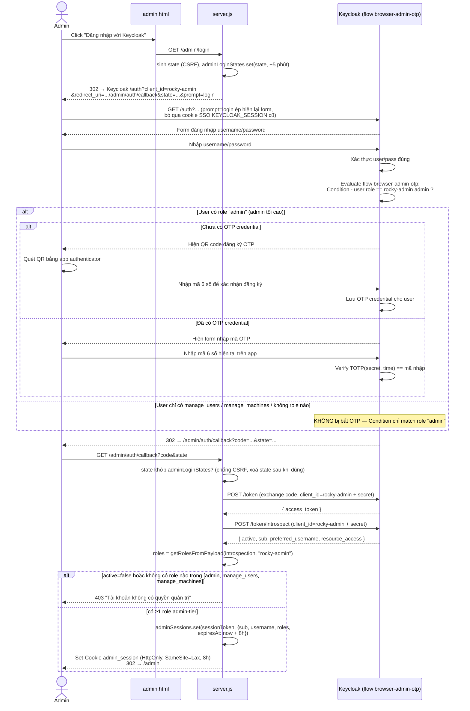
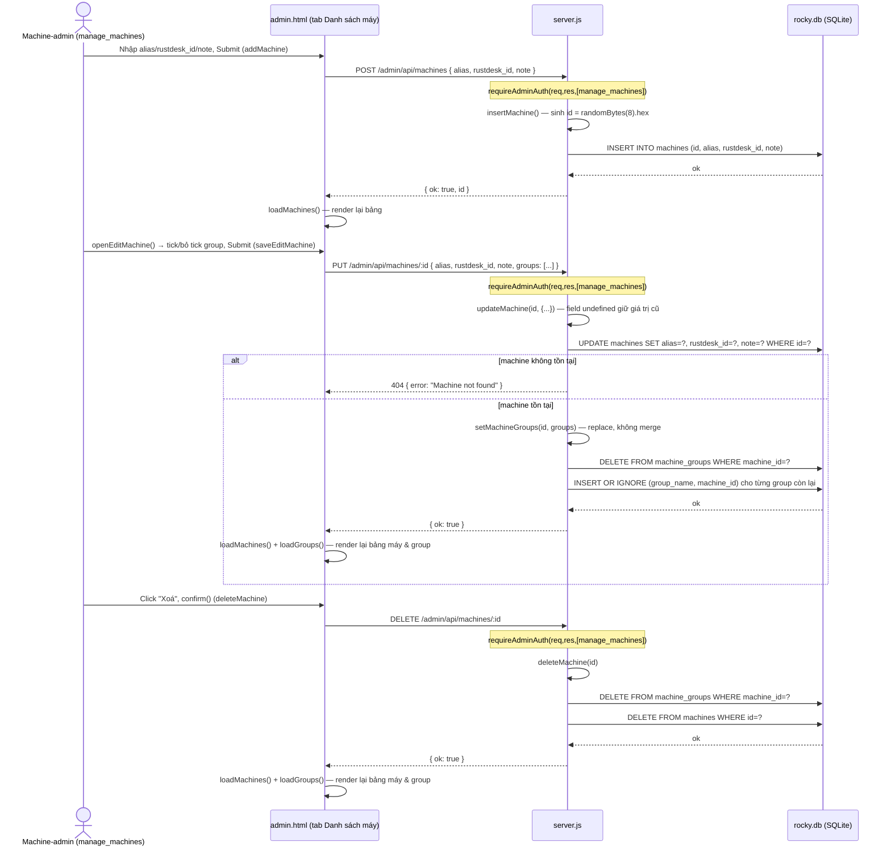

# Tổng hợp Sequence Diagram — ROCKY

## Overview

File này gom **tất cả** sequence diagram (mermaid) đang mô tả nghiệp vụ của ROCKY vào một
chỗ duy nhất, để xem nhanh toàn cảnh các luồng tương tác giữa Sciter client, Rust core,
gateway (`server.js`), Keycloak và SQLite (`data/rocky.db`) mà không phải mở từng file
`docs/<module>.md` riêng lẻ.

**File này KHÔNG phải nguồn chính (source of truth)** — mỗi diagram vẫn sống ở file gốc
của module đó, kèm phần "Điểm chú ý" giải thích chi tiết + rủi ro. Khi luồng đổi, sửa ở
file gốc trước, rồi đồng bộ lại bản copy ở đây. File gốc tương ứng được ghi rõ trên mỗi
diagram.

## Danh sách biểu đồ

| # | Diagram | Nguồn | Trạng thái |
|---|---|---|---|
| 1 | Login Keycloak (Address Book) | `docs/address-book.md` | Đã implement |
| 2 | Check-access trước khi connect | `docs/address-book.md` | Đã implement |
| 3 | Logout (Address Book) | `docs/address-book.md` | Đã implement |
| 4 | Đăng nhập Admin UI (tier-aware) | `docs/admin-ui.md` | Đã implement |
| 5 | Tạo user + gán Group + gán admin-tier role | `docs/admin-ui.md` | Đã implement |
| 6 | Tạo Keycloak Group + map Group↔máy (+ xoá group) | `docs/admin-ui.md` | Đã implement |
| 7 | Lấy hồ sơ user qua `/userinfo` | `docs/user-profile-auth-notes.md` | **Đề xuất — chưa implement** |
| 8 | Đăng nhập Admin UI — chi tiết nhánh 2FA (Conditional OTP) | `docs/keycloak.md` | Đã implement |
| 9 | Quản trị máy trạm (tạo / sửa + gán group / xoá máy) | `server.js` + `public/admin.html` | Đã implement |
| 10 | Đăng xuất Admin UI | `server.js` + `public/admin.html` | Đã implement |

---

## 1. Login Keycloak (Address Book)

> Nguồn: [`docs/address-book.md`](address-book.md) — mục "1. Login"



Điểm chú ý (chi tiết đầy đủ ở file gốc): `BR` và `TIS` là 2 tiến trình tách biệt, chỉ nối
qua `session_code` (entry tự dọn sau 10 phút nếu bỏ ngang, `sweepStaleSessions()`); Rust
chỉ tham gia ở `open_url` và lưu token; `introspectTokenCached` verify chữ ký + `exp` thật
qua Keycloak (đã fix 2026-06-22, thay `decodeJwtPayload` cũ).

---

## 2. Check-access trước khi connect (Address Book)

> Nguồn: [`docs/address-book.md`](address-book.md) — mục "2. Check-access trước khi connect"



Điểm chú ý: chạy đồng bộ/blocking (`reqwest::blocking`); fail-open ở 2 lớp (lỗi mạng và
máy không tồn tại trong DB) — chỉ là UX gate, không phải security boundary đáng tin cậy.

---

## 3. Logout (Address Book)

> Nguồn: [`docs/address-book.md`](address-book.md) — mục "3. Logout"



Điểm chú ý: thứ tự thật là xoá state local → cập nhật UI ngay → mới gửi POST logout; server
giờ trả `revoked` đúng thực tế (đã fix 2026-06-22, thay vì luôn `{ok:true}` bất kể revoke
thành công hay không), kèm xoá token khỏi `introspectionCache` ngay khi logout.

---

## 4. Đăng nhập Admin UI — tier-aware

> Nguồn: [`docs/admin-ui.md`](admin-ui.md) — mục "Đăng nhập Admin UI"

```mermaid
sequenceDiagram
    actor Admin
    participant UI as admin.html
    participant GW as server.js
    participant KC as Keycloak

    Admin->>UI: Click "Đăng nhập với Keycloak"
    UI->>GW: GET /admin/login
    GW-->>Admin: 302 → Keycloak /auth (prompt=login)
    Admin->>KC: Nhập username/password
    KC-->>GW: GET /admin/auth/callback?code&state
    GW->>KC: POST /token, POST /token/introspect
    KC-->>GW: introspection { active, resource_access }
    GW->>GW: roles = getRolesFromPayload(introspection, "rocky-admin")
    alt không có admin/manage_users/manage_machines
        GW-->>Admin: 403 "Tài khoản không có quyền quản trị"
    else có ít nhất 1 trong 3 role admin-tier
        GW->>GW: tạo admin_session { sub, username, roles, expiresAt }
        GW-->>Admin: Set-Cookie admin_session, 302 → /admin
    end
    UI->>GW: GET /admin/session
    GW-->>UI: { authenticated: true, username, roles }
    UI->>UI: myAdminRoles = roles; applyTierVisibility() — ẩn/hiện tab + nút theo tier
```

Điểm chú ý: `requireAdminAuth(req, res, allowedRoles)` gate theo tier ở từng route; `admin`
luôn bypass mọi tier-check; `requireSuperAdmin()` riêng cho route chỉ admin tối cao.

---

## 5. Tạo user + gán Group (machine-access) + gán admin-tier role

> Nguồn: [`docs/admin-ui.md`](admin-ui.md) — mục "Luồng tạo user + gán Group"



Điểm chú ý: gán Group (machine-access) và gán role admin-tier là 2 route tách biệt với 2
tier-gate khác nhau — `manage_users` không gán được role admin-tier (tránh leo thang
quyền); tạo user và gán Group/role là các request riêng, không transaction.

---

## 6. Tạo Keycloak Group + map Group↔máy (gồm nhánh xoá group)

> Nguồn: [`docs/admin-ui.md`](admin-ui.md) — mục "Luồng tạo Keycloak Group + map Group↔máy"



Điểm chú ý: tạo/xoá Group là độc quyền admin tối cao; map Group↔máy là việc của
machine-admin; Group là realm-level (không cần `clientUuid` như role cũ); xoá Group là 2
lệnh tách biệt (Keycloak rồi SQLite), không transaction.

---

## 7. [ĐỀ XUẤT — CHƯA IMPLEMENT] Lấy hồ sơ user qua `/userinfo`

> Nguồn: [`docs/user-profile-auth-notes.md`](user-profile-auth-notes.md) — "Hướng A"
>
> **Trạng thái: chưa có code nào được viết cho luồng này.** Diagram dưới đây mô tả hướng
> triển khai được khuyến nghị (Hướng A) cho tính năng hiển thị "Hi, {tên}" trên UI Sciter
> sau khi login Keycloak, dựa trên `access_token` đã có sẵn từ luồng Login (diagram #1).
> Vẽ ra để làm rõ thiết kế trước khi code, không phản ánh hành vi hiện tại của app.



Điểm chú ý (xem đầy đủ ở file gốc): Keycloak tự verify token trước khi trả profile qua
`/userinfo` — không cần gateway tự verify JWT như `decodeJwtPayload()` đang làm; nhược
điểm là thêm 1 round-trip HTTP mỗi lần cần hiển thị hồ sơ (có thể cache phía gateway);
`access_token` TTL ngắn (~300s mặc định Keycloak) nên cần tính tới hết hạn giữa session.

---

## 8. Đăng nhập Admin UI — chi tiết nhánh 2FA (Conditional OTP)

> Nguồn: [`docs/keycloak.md`](keycloak.md) — mục "2. Login Admin UI"

Bản chi tiết hơn diagram #4 — bóc rõ nhánh Keycloak tự xử lý 2FA (đăng ký OTP lần đầu /
nhập OTP đã có), chỉ áp dụng cho role `admin` (admin tối cao), phản ánh đúng code hiện tại
(kiểm tra **3 role admin-tier** ở bước callback, không chỉ riêng `admin`).



Điểm chú ý: **2FA chỉ bind với role `admin`** — `manage_users`/`manage_machines` đăng
nhập được mà không bị bắt OTP, đây là gap chưa được quyết định lại sau khi mở rộng 3-tier
(xem chi tiết rủi ro ở `docs/keycloak.md`); verify token dùng **introspection** (Keycloak
tự verify signature+expiry), không phải `decodeJwtPayload()` tự decode như luồng client.

## 9. Quản trị máy trạm (tạo / sửa + gán group / xoá máy)

> Nguồn: rà soát trực tiếp `server.js` (route `POST`/`PUT`/`DELETE /admin/api/machines...`)
> + `public/admin.html` (tab "Danh sách máy", hàm `addMachine`/`openEditMachine`/
> `saveEditMachine`/`deleteMachine`). **Chưa đồng bộ sang `docs/admin-ui.md`** — file gốc
> module này cần bổ sung diagram tương ứng sau.



Điểm chú ý: cả 3 route đều gate bằng cùng 1 tier `manage_machines` (không tách
tạo/sửa/xoá như bên Group); `id` máy là `crypto.randomBytes(8).hex` sinh ở server, độc
lập hoàn toàn với `rustdesk_id` (ID thật dùng để kết nối); `PUT` ghi `groups` theo kiểu
**replace toàn bộ** (2 câu SQL `DELETE`+`INSERT` không transaction); xoá máy tự xoá luôn
mapping `machine_groups` liên quan trước khi xoá dòng `machines`, không động tới
Keycloak vì machine chỉ là dữ liệu SQLite nội bộ.

---

## 10. Đăng xuất Admin UI

> Nguồn: rà soát trực tiếp `server.js` (route `POST /admin/logout`, hàm
> `buildKeycloakLogoutUrl`) + `public/admin.html` (hàm `doLogout`). **Chưa đồng bộ sang
> `docs/admin-ui.md`**.

```mermaid
sequenceDiagram
    actor Admin
    participant UI as admin.html
    participant GW as server.js
    participant KC as Keycloak

    Admin->>UI: Click "Đăng xuất" (doLogout)
    UI->>GW: POST /admin/logout
    GW->>GW: adminSessions.delete(cookies.admin_session)
    GW->>GW: buildKeycloakLogoutUrl('/admin')<br/>→ .../protocol/openid-connect/logout?client_id=rocky-admin&post_logout_redirect_uri=.../admin
    GW-->>UI: Set-Cookie admin_session=; Max-Age=0<br/>200 { ok: true, logoutUrl }
    UI->>UI: location.href = data.logoutUrl
    UI->>KC: GET /realms/:realm/protocol/openid-connect/logout?...
    KC->>KC: Kết thúc session SSO (KEYCLOAK_SESSION) của user trên browser
    KC-->>UI: 302 → post_logout_redirect_uri (.../admin)
    UI->>GW: GET /admin/session
    GW-->>UI: { authenticated: false } (cookie admin_session đã bị xoá ở bước trên)
    UI->>UI: render lại login-page
```

Điểm chú ý: xoá `admin_session` (cookie + entry trong `adminSessions` Map) xảy ra
**trước**, ngay trong response của `/admin/logout` — round-trip Keycloak end-session chỉ
là bước dọn tiếp theo phía browser, không phải điều kiện để session admin nội bộ bị coi
là đăng xuất; `doLogout()` không có `try/catch`, khác với logout Address Book (diagram
#3) có chủ đích fire-and-forget; dùng đúng `post_logout_redirect_uri=/admin` đã khai báo
sẵn trong "Valid post logout redirect URIs" của client `rocky-admin`, không cần
`prompt=login` như `/admin/login`.

## Change Log

- **2026-06-22 (fix 3 lỗ hổng auth gateway)** — Đồng bộ lại diagram #1 (Login), #2
  (Check-access), #3 (Logout) từ `docs/address-book.md` sau khi fix: `decodeJwtPayload`
  (không verify) → `introspectTokenCached` (verify thật qua Keycloak, cache 30s) ở #1/#2;
  `/api/auth/logout` trả `revoked` đúng thực tế + xoá cache token ở #3. Chi tiết đầy đủ +
  lý do ở Change Log của `docs/address-book.md`.
- **2026-06-21 (bổ sung quản trị máy trạm + logout)** — Thêm diagram #9 (quản trị máy
  trạm: tạo/sửa+gán group/xoá máy) và #10 (đăng xuất Admin UI), rà soát trực tiếp từ
  `server.js`/`public/admin.html` — **chưa đồng bộ ngược lại `docs/admin-ui.md`** (lưu ý
  khác quy ước thường: thường sửa file gốc module trước rồi mới copy vào đây, lần này
  theo yêu cầu cụ thể chỉ thêm vào file tổng hợp). Không có thay đổi code.
- **2026-06-21 (bổ sung 2FA)** — Thêm diagram #8 (chi tiết nhánh Conditional OTP trong
  luồng login Admin UI), đồng bộ từ `docs/keycloak.md` (file mới tổng hợp riêng phần
  Keycloak: xác thực, 2FA, phân quyền, cấu hình). Không có thay đổi code.
- **2026-06-21** — Tạo file, gom 6 sequence diagram đã có sẵn ở `docs/address-book.md`
  (Login, Check-access, Logout) và `docs/admin-ui.md` (Đăng nhập Admin UI, Tạo user+gán
  Group+admin-role, Tạo Group+map máy) vào một file duy nhất để xem toàn cảnh. Thêm 1
  diagram đề xuất mới (#7, lấy hồ sơ user qua `/userinfo`) dựa trên phân tích sẵn có ở
  `docs/user-profile-auth-notes.md` — đánh dấu rõ là chưa implement, chỉ là thiết kế đề
  xuất. Không có thay đổi code.
