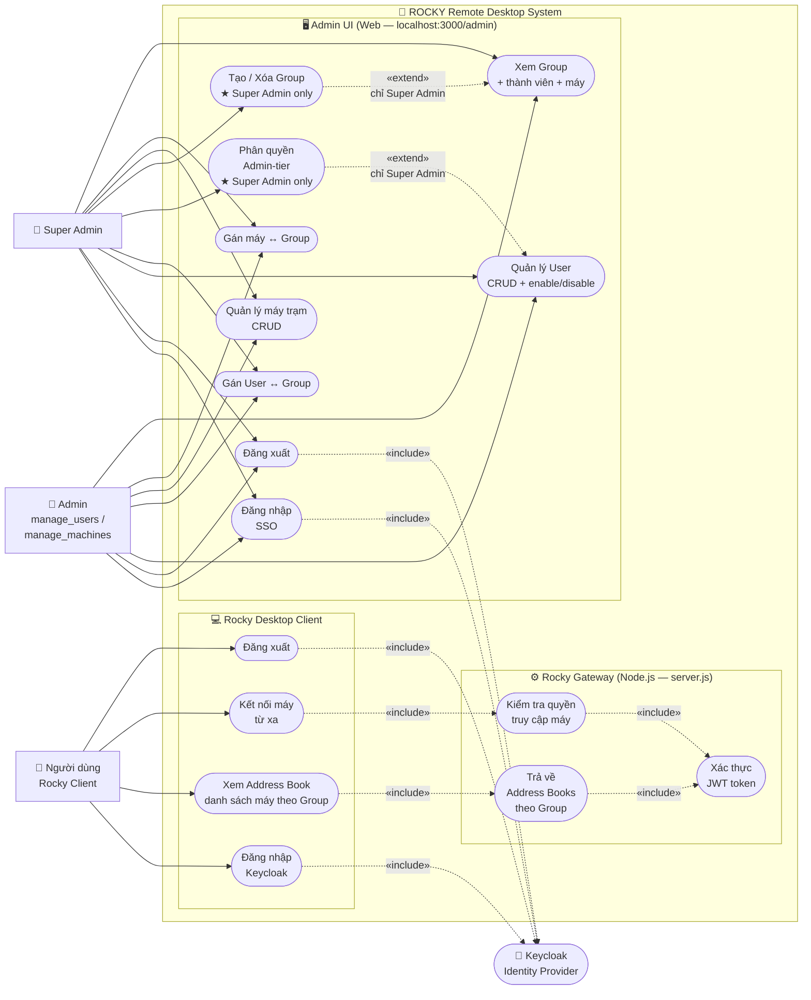
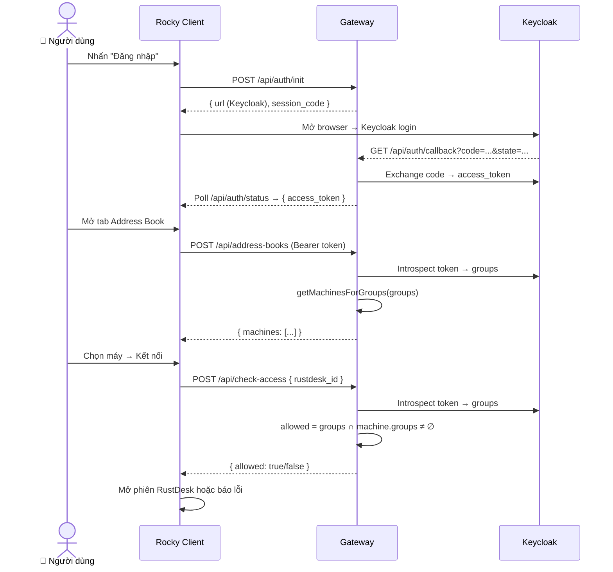

# Use Case Diagram — ROCKY Remote Desktop System

## Tổng quan tác nhân

| Tác nhân | Mô tả |
|---|---|
| 👑 **Super Admin** | Admin tối cao — full quyền trên Admin UI, duy nhất tạo/xóa Group và phân quyền admin-tier |
| 🔧 **Admin** | Tài khoản có role `manage_users` hoặc `manage_machines` — quản lý user/máy nhưng không tạo Group |
| 👤 **Người dùng** | Nhân viên dùng Rocky Desktop Client — login, xem danh sách máy, kết nối từ xa |
| 🔐 **Keycloak** | Identity Provider — xác thực và cấp JWT cho cả Admin UI lẫn Rocky Client |

---

## Biểu đồ Use Case

---

## Chi tiết Use Case theo nhóm

### Admin UI — Quản lý User (role: `manage_users` hoặc `admin`)

| Use Case | Mô tả ngắn | Endpoint |
|---|---|---|
| Đăng nhập SSO | Redirect → Keycloak → callback → session cookie | `GET /admin/login` → `GET /admin/auth/callback` |
| Đăng xuất | Xóa session + redirect Keycloak logout | `POST /admin/logout` |
| Xem danh sách User | Lấy toàn bộ Keycloak user + group membership | `GET /admin/api/users` |
| Tạo User | Tạo user trong Keycloak | `POST /admin/api/users` |
| Xóa User | Xóa vĩnh viễn khỏi Keycloak | `DELETE /admin/api/users/:id` |
| Enable / Disable | Kích hoạt hoặc vô hiệu hóa tài khoản | `PUT /admin/api/users/:id/enabled` |
| Gán User ↔ Group | Thêm / gỡ user khỏi Keycloak Group | `POST/DELETE /admin/api/users/:id/groups` |
| Phân quyền Admin-tier ★ | Gán/gỡ role `admin`/`manage_users`/`manage_machines` | `POST/DELETE /admin/api/users/:id/admin-roles` |

> ★ Chỉ Super Admin (`admin` role) mới thực hiện được.

---

### Admin UI — Quản lý máy trạm (role: `manage_machines` hoặc `admin`)

| Use Case | Mô tả ngắn | Endpoint |
|---|---|---|
| Xem danh sách máy | Toàn bộ máy trong DB + Group gán | `GET /admin/api/machines` |
| Thêm máy | Tạo bản ghi máy mới (alias, rustdesk_id, note) | `POST /admin/api/machines` |
| Sửa máy | Cập nhật alias / rustdesk_id / note | `PUT /admin/api/machines/:id` |
| Xóa máy | Xóa máy khỏi DB + gỡ toàn bộ group mapping | `DELETE /admin/api/machines/:id` |
| Xem Group + thành viên + máy | Hiện Group với danh sách user và máy trạm | `GET /admin/api/groups` |
| Gán máy ↔ Group | Cập nhật mapping N–N machine ↔ Group | `PUT /admin/api/groups` |
| Tạo Group ★ | Tạo Keycloak Group mới | `POST /admin/api/groups` |
| Xóa Group ★ | Xóa Keycloak Group + toàn bộ mapping | `DELETE /admin/api/groups/:id` |

---

### Rocky Desktop Client — Người dùng cuối

| Use Case | Mô tả ngắn | Endpoint / Cơ chế |
|---|---|---|
| Đăng nhập Keycloak | Mở browser → Keycloak → callback → lưu access_token | `POST /api/auth/init` → `GET /api/auth/callback` → poll `/api/auth/status` |
| Xem Address Book | Tải danh sách máy được phép theo Group của user | `POST /api/address-books` (JWT → groups → machines) |
| Kết nối máy từ xa | Kiểm tra quyền → thiết lập phiên RustDesk | `POST /api/check-access` → RustDesk P2P/relay |
| Đăng xuất | Thu hồi access_token tại Keycloak | `POST /api/auth/logout` (revoke token) |

---

### Gateway — Use Case nội bộ (không actor trực tiếp)

| Use Case | Kích hoạt bởi | Mô tả |
|---|---|---|
| Xác thực JWT token | `check-access`, `address-books` | Introspect token qua Keycloak, cache 30 giây |
| Kiểm tra quyền theo Group | Kết nối máy từ xa | So sánh group của user với group gán máy trong DB |
| Trả về Address Books | Xem Address Book | Lọc danh sách máy theo group membership của user |

---

## Luồng chính (sequence tóm tắt)

---

## Change Log

| Ngày | Thay đổi |
|---|---|
| 2026-06-25 | Tạo file — biểu đồ use case tổng quan hệ thống ROCKY sau khi tách gateway thành module |
